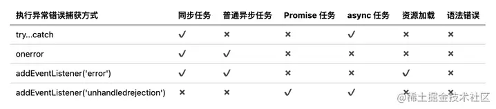

# 浏览器的错误捕捉事件

浏览器捕捉错误的方式有以下几种，但是并不是所有的错误类型都能捕捉到，一下是一些差异情况，这只是一般情况下，实际在做项目的时候用到的都是框架，框架会对浏览器的一些行为做修改，比如angular是代理了浏览器的行为和事件等，因此在angular使用下面的方式进行错误捕捉是完全不起作用的。



如下这些通过浏览器的api进行的错误捕捉，在发生http错误和promise错误的时候是完全没有反应的

```javascript
// 能捕获所有同步执行错误。
// 不能捕获语法错误。
// 能捕获普通异步任务错误。
// 不能捕获Promise任务错误。
// 不能捕获async任务错误。
// 不能捕获资源加载错误。
window.onerror = (e) => {
    console.error('onerror捕捉错误:', e);
    LogsUtils.logToLocal('日志数据' + JSON.stringify({ name: '张三', age: 12 }))
}
// 错误监控
// 可以捕获资源加载的错误
window.addEventListener('error', event => {
    console.error('addEventListener捕捉错误:', event.error);
    LogsUtils.logToLocal('日志数据' + JSON.stringify({ name: '张三', age: 12 }))
    // Sentry.captureException(event.error);
});
window.addEventListener('unhandledrejection', (error) => {
    console.error('unhandledrejection捕捉错误:', error)
    LogsUtils.logToLocal('日志数据' + JSON.stringify({ name: '张三', age: 12 }))
})
this.http.post('/test', null).subscribe({
    next: res => {

    },
    // error: err => {
    //   // console.error('组件内部的错误输出', err);
    // }
})
new Promise((resolve, reject) => {
    reject('2121')
})
```

# angular的错误捕捉

针对angular，其实框架有针对错误的处理方式，可以通过对```ErrorHandler```的实现，完成对错误的捕捉处理，以下是一个写好的demo，其中LogsUtils是封装的一个对错误的处理记录逻辑，通过格式化错误进行记录方便阅读，保存在```localStorage```中，但要注意的是```localStorage```能保存的大小有限，最后其实可以通过```indexdb```进行存储

## AppErrorHandler

```javascript
import { ErrorHandler, Injectable } from "@angular/core";
import { HttpErrorResponse } from "@angular/common/http";
import { LogsUtils } from "./logs-utils";

@Injectable()
export class AppErrorHandler implements ErrorHandler {
    handleError(error: Error | HttpErrorResponse) {
        if (!navigator.onLine) {
            console.error("浏览器离线!", error);
            LogsUtils.logToLocal('浏览器离线\r\n' + JSON.stringify({ name: '张三', age: 12 }))
        } else {
            if (error instanceof HttpErrorResponse) {
                if (!navigator.onLine) {
                    console.error("离线错误!", error);
                    LogsUtils.logToLocal('离线错误\r\n' + error.message)
                } else {
                    // Handle Http Error (4xx, 5xx, ect.)
                    console.error("http错误!", error);
                    const status = error.status;
                    const message = error.message.replace(/\r?\n/g, "\r\n");
                    const errorTip = error.error.replace(/\r?\n/g, "\r\n");
                    LogsUtils.logToLocal(`Http错误：\r\n状态：${status}\r\n简略信息：${message}\r\n错误返回：\r\n${errorTip}`)
                }
            } else {
                // const name = error.name;
                // const message = error.message.replace(/\r?\n/g, "\r\n");
                console.error("应用错误!", error);
                const stack = error.stack.replace(/\r?\n/g, "\r\n");
                LogsUtils.logToLocal(`错误堆栈：${stack}`)
            }
        }
    }
}
```

## LogsUtils

```javascript
export class LogsUtils {

  /**
   * 在浏览器本地记录日志
   */
  static logToLocal(loginfo: string) {
    try {
      console.log('记录日志--')
      if (typeof (localStorage) !== 'undefined') {
        let now = new Date()
        const logClock = now.toLocaleDateString() + '/' + now.getHours().toString().padStart(2, '0');
        // 日志持久化寻址编号，采取日期来定位 yyyy/MM/dd
        // 设置当前日志所在区间的名称编号，避免只写一个item过大失败
        let agentlogId = logClock
        let logstr = window.localStorage.getItem(agentlogId)
        if (typeof (logstr) === 'undefined' || !logstr) {
          logstr = ''
        }
        let str = '[' + agentlogId + ']' + loginfo + '\r\n' // 将日志内容格式化，加入日期
        logstr = logstr + str
        // 将日志写入localStorage中,单个item不能超过5MB，不过一般一个小时的日志不可能超过这么多
        if (logstr.length * 2 < 1024 * 1024 * 5) {
          localStorage.setItem(agentlogId, logstr)
        } else {
          console.log('当前时段' + agentlogId + '记录的日志太多已无法再写日志到localStorage中')
        }
        // 日志写入完毕后，注意只有同域名同端口的服务端的页面才能读取，否则依然是不同的
      } else {
        console.log('抱歉！您的浏览器不支持记录本地日志。IE11浏览器则可能是因为在本地打开的网页')
      }
    } catch (e) {
      console.log('记录日志失败', e)
    }

  }

  /**
   * 生成和取得指定日志文件 yyyy/MM/dd/hh
   */
  static downloadLog(agentlogId: string) {
    let browserMatch = uaMatch()
    let broserVer = browserMatch.browser + browserMatch.version
    let downloadFileName = agentlogId + '-cc-agent.log'
    let file = 'data:text/plain;charset=utf-8,'
    if (broserVer.indexOf('IE11') >= 0) {
      try {
        let logstr = localStorage.getItem(agentlogId)
        file += logstr
        let blobObject = new Blob([file])
        //   window.navigator.msSaveBlob(blobObject, downloadFileName)
        const navigator: any = window.navigator;
        if (navigator && navigator.msSaveBlob) {
          navigator.msSaveBlob(blobObject, downloadFileName);
          // navigator.msSaveOrOpenBlob(blobObject, downloadFileName);
        } else {
          const a = document.createElement('a')     //创建一个a链接
          const url = window.URL.createObjectURL(blobObject)
          a.href = url  //创建a连接的href
          a.download = downloadFileName //设置名称
          a.click()   //点击事件
          window.URL.revokeObjectURL(url) //释放url对象
        }
      } catch (e) {
        alert('下载文件时出现错误' + e)
      }
    } else {
      try {
        downloadFileName = agentlogId + '-cc-agent.log'
        file = 'data:text/plain;charset=utf-8,'
        let logstr = localStorage.getItem(agentlogId)
        let encoded = encodeURIComponent(logstr) // 这一步为了下载是必须的
        file += encoded
        let downloadevent = document.createElement('a')
        downloadevent.href = file
        downloadevent.target = '_blank'
        downloadevent.download = downloadFileName
        document.body.appendChild(downloadevent)
        downloadevent.click()
        downloadevent.remove()
      } catch (e) {
        alert('您的浏览器不支持记录本地日志。IE11浏览器则可能是因为在本地打开的网页' + e)
      }
    }
    this.logToLocal('完成一次日志下载，下载日志名：' + agentlogId)
  }

  /**
   * 查看日志
   * toLocaleDateString
   * @param agentlogId yyyy/MM/dd/hh
   * @returns 
   */
  static getLog(agentlogId: string) {
    try {
      this.logToLocal('查询一次日志，查询日志名：' + agentlogId)
      return localStorage.getItem(agentlogId)
    } catch (e) {
      alert('您的浏览器不支持记录本地日志。IE11浏览器则可能是因为在本地打开的网页' + e)
    }
  }

  /**
   * 定期清除日志，释放空间可以用到 注意：以下清理操作是异步的，所以快速操作可能感觉起来没有清理完毕
   * @param agentlogId yyyy/MM/dd/hh
   */
  static deleteLog(agentlogId: string) {
    try {
      localStorage.removeItem(agentlogId)
      this.logToLocal('完成一次日志删除，删除日志名：' + agentlogId)
    } catch (e) {
      alert('您的浏览器不支持记录本地日志。IE11浏览器则可能是因为在本地打开的网页' + e)
    }
  }

}
```

## 下载时候获取浏览器信息

```javascript
/**
 * 判断取得当前浏览器的版本
 */
function uaMatch() {
  // 正则表达式方式来判定user-agent字符串，得到当前访问浏览器（http代理）的版本
  let userAgent = navigator.userAgent
  let rMsie = /(msie\s|trident.*rv:)([\w.]+)/
  let rFirefox = /(firefox)\/([\w.]+)/
  let rOpera = /(opera).+version\/([\w.]+)/
  let rChrome = /(chrome)\/([\w.]+)/
  let rSafari = /version\/([\w.]+).*(safari)/
  let ua = userAgent.toLowerCase()
  let match = rMsie.exec(ua)

  if (match != null) {
    return { browser: 'IE', version: match[2] || '0' }
  }
  match = rFirefox.exec(ua)
  if (match != null) {
    return { browser: match[1] || '', version: match[2] || '0' }
  }
  match = rOpera.exec(ua)
  if (match != null) {
    return { browser: match[1] || '', version: match[2] || '0' }
  }
  match = rChrome.exec(ua)
  if (match != null) {
    return { browser: match[1] || '', version: match[2] || '0' }
  }
  match = rSafari.exec(ua)
  if (match != null) {
    return { browser: match[2] || '', version: match[1] || '0' }
  }
  if (match == null) {
    return { browser: '', version: '0' }
  }
}
```

# indexdb的封装

```javascript
export class IndexedDBUtils {
  /**
   * 打开数据库
   * @param  dbName 数据库的名字
   * @param  storeName 仓库名称
   * @param  version 数据库的版本
   * @return  该函数会返回一个数据库实例
   */
  static openDB(dbName: string, version = 1, dbInfo: { keyPath: string, indexs: Array<string> }) {
    return new Promise<IDBDatabase>((resolve, reject) => {
      //  兼容浏览器
      // @ts-ignore
      let indexedDB: IDBFactory = window.indexedDB || window.mozIndexedDB || window.webkitIndexedDB || window.msIndexedDB;
      let db: IDBDatabase;
      // 打开数据库，若没有则会创建
      const request = indexedDB.open(dbName, version);
      // 数据库打开成功回调
      request.onsuccess = (event) => {
        db = (event.target as any).result; // 数据库对象
        resolve(db);
      };
      // 数据库打开失败的回调
      request.onerror = (event) => reject(event);

      // 数据库有更新时候的回调
      request.onupgradeneeded = (event) => {
        // 数据库创建或升级的时候会触发
        db = (event.target as any).result; // 数据库对象
        // 创建存储库，建表
        let objectStore: IDBObjectStore = db.createObjectStore("table", {
          keyPath: dbInfo.keyPath, // 这是主键
          autoIncrement: true // 实现自增
        });
        // 创建索引，在后面查询数据的时候可以根据索引查
        dbInfo.indexs.forEach(item => {
          objectStore.createIndex(item, item, { unique: false });
        })
      };
    });
  }

  /**
   * 新增数据，插入的数据是一个对象，而且必须包含我们声明的索引键值对
   * @param  db 数据库实例
   * @param  storeName 仓库名称
   * @param  data 数据
   */
  static addData(db: IDBDatabase, storeName: string, data: any) {
    let request = db
      .transaction([storeName], "readwrite") // 事务对象 指定表格名称和操作模式（"只读"或"读写"）
      .objectStore(storeName) // 仓库对象
      .add(data);

    request.onsuccess = (event) => {
      console.log("数据写入成功", event);
    };

    request.onerror = (event) => {
      console.log("数据写入失败", event);
    };
  }
  /**
   * 通过主键读取数据
   * @param  db 数据库实例
   * @param  storeName 仓库名称
   * @param  key 主键值
   */
  static getDataByKey(db: IDBDatabase, storeName: string, key: string | number) {
    return new Promise((resolve, reject) => {
      let transaction = db.transaction([storeName]); // 事务
      let objectStore = transaction.objectStore(storeName); // 仓库对象
      let request = objectStore.get(key); // 通过主键获取数据
      request.onerror = (event) => {
        reject(event);
      };
      request.onsuccess = (event) => {
        resolve(request.result);
      };
    });
  }
  /**
   * 通过索引读取数据
   * @param  db 数据库实例
   * @param  storeName 仓库名称
   * @param  indexName 索引名称
   * @param  indexValue 索引值
   */
  static getDataByIndex(db: IDBDatabase, storeName: string, indexName: string, indexValue: string | number) {
    return new Promise((resolve, reject) => {
      let store = db.transaction(storeName, "readwrite").objectStore(storeName);
      let request = store.index(indexName).get(indexValue);
      request.onerror = (event) => {
        reject(event)
      };
      request.onsuccess = (event) => {
        let result = (event.target as IDBRequest).result;
        resolve(result);
      };
    })
  }
  /**
   * 获取一个对象仓库的所有数据
   * @param  db 数据库实例
   * @param  storeName 仓库名称
   */
  static getAllByStroe(db: IDBDatabase, storeName: string) {
    return new Promise((resolve, reject) => {
      let transaction = db.transaction([storeName]); // 事务
      let objectStore = transaction.objectStore(storeName); // 仓库对象
      let request = objectStore.getAll();
      request.onerror = (event) => {
        reject(event)
      };
      request.onsuccess = (event) => {
        resolve(request.result);
      };
    });
  }
  /**
   * 通过游标读取数据，拿到的也是一个对象仓库的所有数据
   * @param  db 数据库实例
   * @param  storeName 仓库名称
   */
  static getDataByCursor(db: IDBDatabase, storeName: string) {
    return new Promise((resolve, reject) => {
      let list = [];
      let store = db
        .transaction(storeName, "readwrite") // 事务
        .objectStore(storeName); // 仓库对象
      let request = store.openCursor(); // 指针对象
      // 游标开启成功，逐行读数据
      request.onsuccess = (event) => {
        let cursor = (event.target as IDBRequest).result;
        if (cursor) {
          // 必须要检查
          list.push(cursor.value);
          cursor.continue(); // 遍历了存储对象中的所有内容
        } else {
          // console.log("游标读取的数据：", list);
          resolve(list);
        }
      };
    })
  }

  /**
   * 通过索引和游标查询记录
   * @param  db 数据库实例
   * @param  storeName 仓库名称
   * @param  indexName 索引名称
   * @param  indexValue 索引值
   */
  static getDataByIndexCursor(db: IDBDatabase, storeName: string, indexName: string, indexValue: string | number) {
    return new Promise((resolve, reject) => {
      let list = [];
      let store = db.transaction(storeName, "readwrite").objectStore(storeName); // 仓库对象
      let request = store
        .index(indexName) // 索引对象
        .openCursor(IDBKeyRange.only(indexValue)); // 指针对象
      request.onsuccess = (event) => {
        let cursor = (event.target as IDBRequest).result;
        if (cursor) {
          // 必须要检查
          list.push(cursor.value);
          cursor.continue(); // 遍历了存储对象中的所有内容
        } else {
          // console.log("游标索引查询结果：", list);
          resolve(list);
        }
      };
      request.onerror = (event) => reject(event);
    })
  }

  /**
   * 通过索引和游标分页查询记录
   * @param  db 数据库实例
   * @param  storeName 仓库名称
   * @param  indexName 索引名称
   * @param  indexValue 索引值
   * @param  page 页码
   * @param  pageSize 查询条数
   */
  static getDataByIndexCursorAndPage(
    db: IDBDatabase,
    storeName: string,
    indexName: string,
    indexValue: string | number,
    page: number,
    pageSize: number
  ) {
    return new Promise((resolve, reject) => {
      let list = [];
      let counter = 0; // 计数器
      let advanced = true; // 是否跳过多少条查询
      let store = db.transaction(storeName, "readwrite").objectStore(storeName); // 仓库对象
      let request = store.index(indexName).openCursor(IDBKeyRange.only(indexValue));
      request.onsuccess = (event) => {
        let cursor = (event.target as IDBRequest).result;
        if (page > 1 && advanced) {
          advanced = false;
          cursor.advance((page - 1) * pageSize); // 跳过多少条
          return;
        }
        if (cursor) {
          // 必须要检查
          list.push(cursor.value);
          counter++;
          if (counter < pageSize) {
            cursor.continue(); // 遍历了存储对象中的所有内容
          } else {
            cursor = null;
            // console.log("分页查询结果", list);
            resolve(list);
          }
        } else {
          resolve(list);
          console.log("分页查询结果", list);
        }
      };
      request.onerror = (event) => reject(event);
    })
  }

  /**
   * 更新数据
   * @param  db 数据库实例
   * @param  storeName 仓库名称
   * @param  data 数据
   */
  static updateDB(db: IDBDatabase, storeName: string, data) {
    return new Promise((resolve, reject) => {
      let request = db
        .transaction([storeName], "readwrite") // 事务对象
        .objectStore(storeName) // 仓库对象
        .put(data);

      request.onsuccess = (event) => {
        resolve(event);
      };

      request.onerror = (event) => {
        reject(event)
      };
    })
  }

  /**
   * 通过主键删除数据
   * @param  db 数据库实例
   * @param  storeName 仓库名称
   * @param  id 主键值
   */
  static deleteDataByKey(db: IDBDatabase, storeName: string, id: string | number) {
    return new Promise((resolve, reject) => {
      let request = db.transaction([storeName], "readwrite").objectStore(storeName).delete(id);
      request.onsuccess = (event) => resolve(event);
      request.onerror = (event) => reject(event);
    })
  }

  /**
   * 通过索引和游标删除指定的数据
   * @param  db 数据库实例
   * @param  storeName 仓库名称
   * @param  indexName 索引名
   * @param  indexValue 索引值
   */
  static deleteDataByCursor(db: IDBDatabase, storeName: string, indexName: string, indexValue: string | number) {
    return new Promise((resolve, reject) => {
      let store = db.transaction(storeName, "readwrite").objectStore(storeName);
      let request = store
        .index(indexName) // 索引对象
        .openCursor(IDBKeyRange.only(indexValue)); // 指针对象
      request.onsuccess = (event) => {
        let cursor = (event.target as IDBRequest).result;
        let deleteRequest;
        if (cursor) {
          deleteRequest = cursor.delete(); // 请求删除当前项
          deleteRequest.onerror = (e) => reject(e);
          deleteRequest.onsuccess = (e) => resolve(e);
          cursor.continue();
        }
      };
      request.onerror = (event) => reject(event);
    })
  }

  /**
   * 关闭数据库
   * @param  db 数据库实例
   */
  static closeDB(db: IDBDatabase) {
    db.close();
    console.log("数据库已关闭");
  }
  /**
   * 删除数据库
   * @param  dbName 数据库名称
   */
  static deleteDBAll(db: IDBDatabase, dbName: string) {
    db.close();
    let deleteRequest = window.indexedDB.deleteDatabase(dbName);
    deleteRequest.onerror = (event) => {
      console.log("删除失败");
    };
    deleteRequest.onsuccess = (event) => {
      console.log("删除成功");
    };
  }


}
```

# indexdb的使用

可以在捕捉到错误的时候，打开```indexdb```数据库，然后通过```addData```往数据库中保存错误信息，然后关闭数据库。```indexdb```的知识需要自己多了解

## html

```html
<div>
  <button (click)="download2log()">下载日志</button>
  <button (click)="delete2log()">删除日志</button>
  <button (click)="test()">测试错误</button>
  <br>
  <br>
  <button (click)="openDB()">打开数据库</button>
  <button (click)="addData()">添加数据</button>
  <button (click)="getDataByIndex()">通过索引读取数据</button>
  <button (click)="getDataByKey()">通过主键读取数据</button>
  <button (click)="getAllByStroe()">获取一个仓库的所有数据</button>
  <button (click)="getDataByCursor()">通过游标读取数据</button>
  <button (click)="getDataByIndexCursor()">通过游标索引读取数据</button>
  <button (click)="getDataByIndexCursorAndPage()">通过索引和游标分页查询记录</button>
  <button (click)="deleteDataByKey()">删除数据</button>
  <button (click)="closeDB()">关闭数据库</button>
  <button (click)="deleteDBAll()">删除数据库</button>
</div>
```

## typescript

```javascript
  test() {
    let obj: any = {};
    if (obj.b.c) {

    }
  }
  download2log() {
    let now = new Date()
    const time = now.toLocaleDateString() + '/' + now.getHours().toString().padStart(2, '0');
    LogsUtils.downloadLog(time)
  }
  // 删除日志
  delete2log() {
    let now = new Date()
    const time = now.toLocaleDateString() + '/' + now.getHours().toString().padStart(2, '0');
    LogsUtils.deleteLog(time)
  }

  openDB() {
    IndexedDBUtils.openDB('testDB', 1, { keyPath: 'id', indexs: ['name', 'gender', 'age'] }).then(data => {
      console.log('打开数据库回调成功', data);
      this.dbInstance = data;
    })
  }
  closeDB() {
    IndexedDBUtils.closeDB(this.dbInstance);
  }
  deleteDataByKey() {
    IndexedDBUtils.deleteDataByKey(this.dbInstance, 'table', 8).then(data => {
      console.log('删除结果', data)
    });
  }
  deleteDBAll() {
    IndexedDBUtils.deleteDBAll(this.dbInstance, 'testDB');
  }
  addData() {
    IndexedDBUtils.addData(this.dbInstance, 'table', { name: '张三', gender: 'man', age: 20 })
    IndexedDBUtils.addData(this.dbInstance, 'table', { name: '李四', gender: 'female', age: 18 })
    IndexedDBUtils.addData(this.dbInstance, 'table', { name: '王五', gender: 'man', age: 19 })
    IndexedDBUtils.addData(this.dbInstance, 'table', { name: '赵六', gender: 'female', age: 19 })
    IndexedDBUtils.addData(this.dbInstance, 'table', { name: '张飞', gender: 'female', age: 21 })
    IndexedDBUtils.addData(this.dbInstance, 'table', { name: '关羽', gender: 'man', age: 22 })
    IndexedDBUtils.addData(this.dbInstance, 'table', { name: '赵云', gender: 'female', age: 23 })
    IndexedDBUtils.addData(this.dbInstance, 'table', { name: '黄忠', gender: 'man', age: 20 })
    IndexedDBUtils.addData(this.dbInstance, 'table', { name: '马超', gender: 'man', age: 19 })
    IndexedDBUtils.addData(this.dbInstance, 'table', { name: '张三' })
    IndexedDBUtils.addData(this.dbInstance, 'table', { gender: 'man' })
    IndexedDBUtils.addData(this.dbInstance, 'table', { age: 20 })
  }
  getAllByStroe() {
    IndexedDBUtils.getAllByStroe(this.dbInstance, 'table').then(data => {
      console.log('获取一个仓库的所有数据', data);
    })
  }
  getDataByIndex() {
    IndexedDBUtils.getDataByIndex(this.dbInstance, 'table', 'name', '张三').then(data => {
      console.log('通过索引读取数据', data);
    });
  }
  getDataByKey() {
    IndexedDBUtils.getDataByKey(this.dbInstance, 'table', 2).then(data => {
      console.log('通过主键读取数据', data);
    });
  }
  getDataByCursor() {
    IndexedDBUtils.getDataByCursor(this.dbInstance, 'table').then(data => {
      console.log('通过游标读取数据', data);
    });
  }
  getDataByIndexCursor() {
    IndexedDBUtils.getDataByIndexCursor(this.dbInstance, 'table', 'name', '张三').then(data => {
      console.log('通过索引和游标查询记录', data);
    });
  }
  getDataByIndexCursorAndPage() {
    IndexedDBUtils.getDataByIndexCursorAndPage(this.dbInstance, 'table', 'name', '张三', 2, 1).then(data => {
      console.log('通过索引和游标分页查询记录', data);
    });
  }
```

