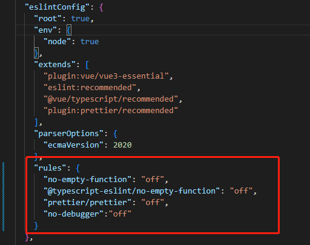
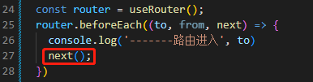
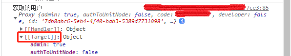

1、创建项目的时候不要选择prettier方式格式化，这是一个固执己见的格式化工具，项目代码没错，格式化问题比项目代码问题还多

2、路径别名的问题，待处理

3、关于eslint的配置可以在package.json的eslintConfig.rules的属性中配置



4、路由方法相关的，注意有next方法的，逻辑处理完成之后一定要next()，否则不会进入页面



5、```useStore```只能在```setup```中使用，其他地方只能路径引入

- setup：

```const store = useStore();```

```store.dispatch("setLoginUser", result);```

- 其他地方

```import store from "../store";```

6、被proxy包裹的数据，要进行赋值请用toRaw()拿到原始值在赋值，toRaw方法拿到它的原始数据，对原始数据进行修改这样就不会被追踪，也不会更新UI界面，如果想通过toRaw拿到ref类型的原始数据（创建时传入的那个数据），那么就必须明确的告诉toRaw方法，要获取的是.value的值，因为经过Vue处理之后，.value中保存的才是当初创建时传入的那个原始数据

```
const test = toRaw(store.state.loginUser);

console.log('获取的用户', test);
```


