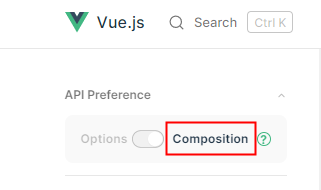
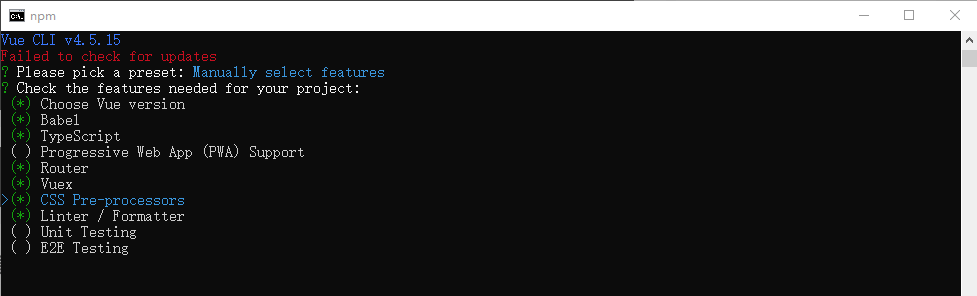
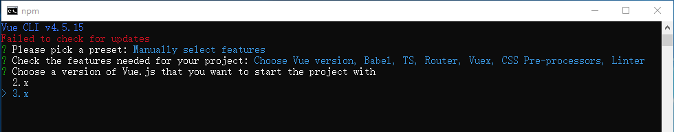
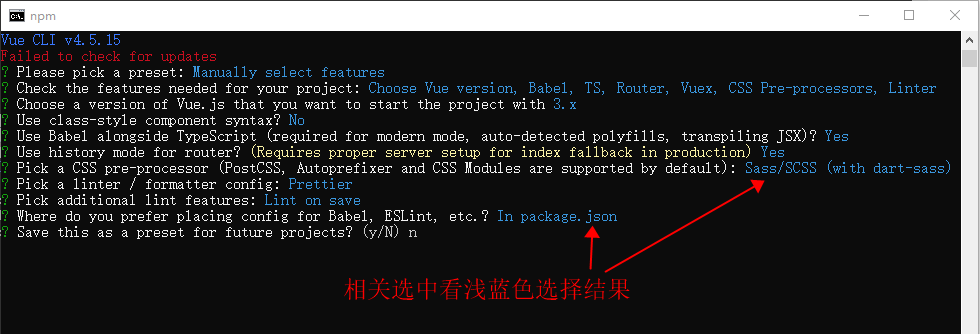
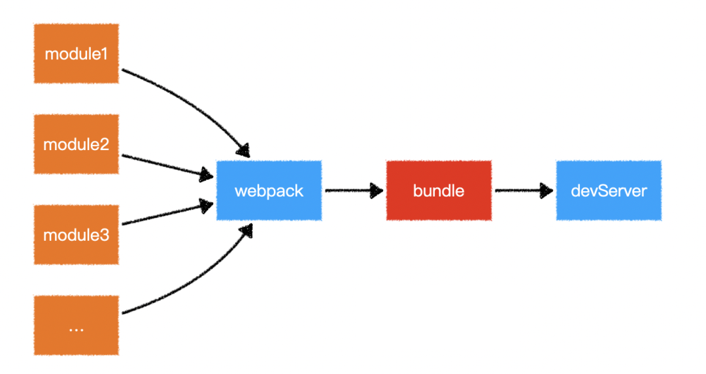
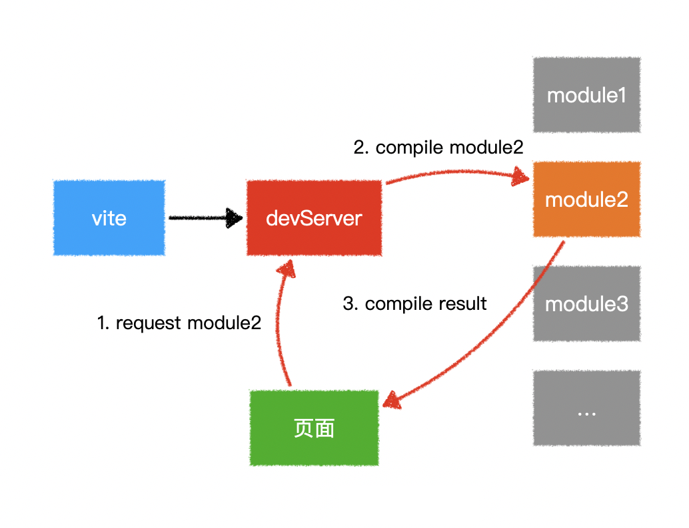
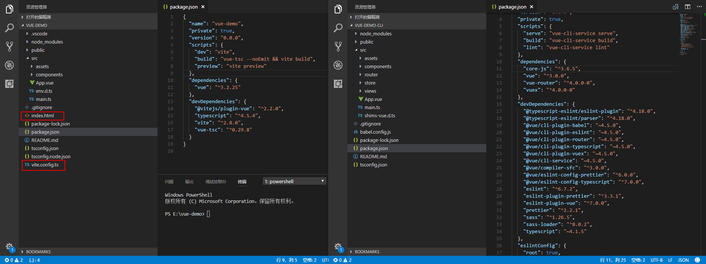

## 概况

关于生成vue项目，有多种方式，这里介绍两种。

**注意：项目开发中建议使用vue-cli的方式，考虑到后续会用到qiankun框架，使用vite问题会比较多，而vue-cli比较成熟，qiankun对vue的文档也是以vue-cli的方式为主，避免不必要的技术门槛**。

目前而言vite方式呈上升趋势，但是项目的配套，即vue全家桶不能一键生成，需要手动安装和配置，vite的优势是快，vue-cli的优势是全面和稳定。此文档以vue3为基础，与vue2的区别请自行查阅文档。

另：```vue-cli```远没有```angular-cli```强大，大多情况下vue-cli只用来生成项目，至于**.vue**文件，需要手动创建，包括过滤器(管道)等，文件的引入需要手动引入，目前没有发现有插件支持，关于组件命名，沿用cli的风格，采用大驼峰命名。

关于vscode，目前的vscode的版本实在太低，导致无法使用插件最新功能，还有vscode使用时间长之后，格式化插件不生效，对于使用vue，目前版本会出现```has no exported member 'xxx'```的问题也是由于vscode的版本过低的原因，插件无法智能提示导入，所以建议不要锁定vscode版本，统一让vscode自动更新，插件会随着vscode更新自动更新，同样可以避免格式化的问题。

vue英文文档地址，建议阅读英文文档，中文文档默认是options api示例，与实际开发存在差异，并且不及时更新，英文文档进入之后切换到composition Api模式进行阅读

```http
https://vuejs.org/guide/introduction.html
```



## vue-cli生成项目

全局安装cli

```shell
npm install -g @vue/cli
```

安装完成之后创建项目

```shell
vue create hello-world
```

执行create之后选择如下选项







## vite生成项目

使用vite进行开发，该工具由vue作者开发，**node的版本需要12.0.0+**，不需要全局安装其他东西，直接执行npm命令。

使用vite的理由是：在使用 vue-cli + Webpack 这套组合工具的时候，由于我们启动的是基于 Webpack 这类打包工具的开发服务器，所以它每次都必须要先打包完成整个项目才能启动服务器，这通常需要花费不少时间，而且是项目的规模越大，服务器启动所花费的时间就越多，有时候甚至要等上十几分钟，这会严重影响我们的开发效率。而 Vite 则选择在一开始就将项目中的模块区分为**依赖项**和**项目源码**两大类，并根据*项目依赖项并不会经常发生变化*的特点对这两类模块加以分别处理，这样做就会大大加快开发服务器启动时间，我们的开发体验也会因此得到很大程度上的改善。

使用下面的命令根据提示选择，**主要选择vue以及vue-ts两项**

```shell
npm init vite my-vue-app
```

**webpack和vite的区别**，下面的对比图可以看出vite快的原因。





vite生成的vue项目仅仅只是简单的vue，实际开发中还需要路由```router```以及状态管理```vuex```（vue3开始视乎不在需要vuex了，视项目情况而定）以及```css预处理器```等

### 安装路由

```shell
npm install vue-router
```

安装之后，新建名为**router的文件夹**以及**ts文件**，文件名可以使用index.ts，好处是导入的时候不用指定到具体文件，坏处是当打开多个index文件容易混淆，index.ts文件内容为，与angular类似。

```typescript
import { createRouter, createWebHashHistory } from 'vue-router';
import HelloWorld from '../components/HelloWorld.vue';

export default createRouter({
    // 指定路由模式
    history: createWebHashHistory(),
    // 路由地址
    routes: [
        { path: '/about', component: HelloWorld }
    ]
})
```

在main.ts中挂载

```typescript
createApp(App).use(router).mount('#app')
```

### 安装vuex

关于vuex请自行了解，主要用于管理项目公共变量等，并不一定要使用

```shell
npm install vuex
```

安装之后，新建名为store的文件夹以及ts文件，内容为

```typescript
import { createStore } from "vuex";

export default createStore({
  state: {},
  mutations: {},
  actions: {},
  modules: {},
});
```

在main.ts中挂载

```typescript
createApp(App).use(router).use(store).mount('#app')
```

### 安装scss-loader

其他预处理器一样的道理

```shell
npm install --save-dev sass
```

## vue-cli与vite生成项目的差异



## 知识点

### .vue单文件组件

实际开发中都是以```.vue```单文件组件形式的开发，```.vue```的固定格式如下

```javascript
<template>
	<!--html部分必须有一个根节点，不然提示报错-->
    <div>
      <input type="number" v-model="count">
      <input type="text" v-model="obj.name">
    </div>
</template>
// vue3的setup，这是一种方式，也有setup()函数式的方式，但是繁琐
// lang="ts"表示使用typescript语言开发
<script setup lang="ts">
    
import { ref, reactive } from "vue";
let count = ref<string>(0);
const obj = reactive({ name: "zhangsan", age: 18 });

</script>
// css部分，一般加上scoped表示时局部css，值作用与当前组件
// lang="scss"表示使用scss预处理器
<style scoped lang="scss">

</style>

```

### 生命周期

vue的生命周期似乎有点多，见如下图，红色框的都是开发中可以使用的钩子，不过要注意的是在```script setup```组件中需要添加on前缀，常用的就几个。

- 要注意的是，在```script setup```中，setup是先于created的，所以没有```onCreated```这个方法，**要想在mounted前进行http数据请求，可以在setup中调用请求方法，在setup中直接调用方法等于在angular中的```ngOnInit```中调用方法**。

- ```onMounted()```和angular中```ngAfterViewInit```一样，是在dom节点完成之后执行。

- ```onUpdated()```和angular中的```ngDoCheck```差不多，注意是差不多
- ```onUnmounted()```和angular中的```ngOnDestroy```一样

上面三个是开发中常用到的生命周期钩子，还有两个是比较特殊的，```activated```和```deactivated```，这两个是被 ```keep-alive ```缓存的组件在激活和卸载时调用。其他详细信息请参考官方文档


### 模板语法

属性绑定采用**v-bind:xx**的方式，如**v-bind:disabled**。简写方式是**:disabled**

html中展示变量值与angular一样```{{变量}}```

### 双向绑定

需要双向绑定的数据需要用**ref**或**reactive**定义，分别针对值类型数据和引用类型数据，模板中使用**v-model**进行绑定，vue3的双向绑定与angular的双向绑定有很大的区别，有点啰嗦，详情请自行查阅文档

```html
// template
<input type="number" v-model="count">{{count}}
<input type="text" v-model="obj.name">{{obj.name}}
<button @click="btnClick()">点击</button>
```

```javascript
// js
let count = ref<string>(0);
const obj = reactive({ name: "zhangsan", age: 18 });

function btnClick() {
  console.log("输入的值ref", count.value);
  console.log("输入的值reactive", obj.name);
  setTimeout(() => {
    console.log("一秒后ref", count.value + 1);
  }, 1000);
}
```

- ref用来定义基本类型数据，ref也可以用来定义对象（或数组）类型数据，它内部会自动通过reactive转为代理对象
- reactive用来定义对象（或数组）类型数据

- ref通过Object.defineProperty()的get与set来实现响应式（数据劫持）
- reactive通过使用Proxy来实现响应式（数据劫持），并通过Reflect操作源对象内部的数据

- **ref定义的数据：操作数据需要.value,读取数据时模板中直接读取 不需要.value**
- **reactive定义数据时：操作数据与读取数据均不需要.value**

### 指令

vue指令与angular指令大同小异，相关指令有

**v-if**  **v-else-if** **v-else**

```html
<div v-if="count>15" style="background-color:red;">输入值大于15</div>
<div v-else-if="count>10" style="background-color:yellow;">输入值大于10小于15</div>
<div v-else style="background-color:green;">输入值小于10</div>
```

**v-for** 需要注意，由于diff算法，当使用v-for时，**必须要绑定一个唯一的key值**，所以接口在返回列表数据的时候一定要返回id或者不为空的唯一值，这里作为演示使用了下标，开发中切记不可使用。

```html
<div v-for="(item,index) in ['q','w','e','r','t','y','u']" :key="index">{{item}}</div>
```

**@click**

```html
<button @click="btnClick()">点击</button>
```

**v-bind:class** 简写形式 **:class**，与angular的方式差不多

```html
<div class="static" :class="{ active: isActive }">:class</div>
<div class="static" :class="templateClass()">:class函数式</div>
<button @click="switchClass()">:class</button>
```

```javascript
let isActive = ref<boolean>(true);
function switchClass() {
  isActive.value = !isActive.value;
  console.log("当前活动状态", isActive.value);
}
function templateClass() {
  if (isActive.value) {
    return "active";
  }
}
```

**v-bind:style** 简写形式 **:style**，与angular的方式差不多

```html
<div class="static" :style="{ backgroundColor: bgColor }">:style</div>
<div class="static" :style="templateStyle()">:style函数式</div>
<button @click="switchStyle()">:style</button>
```

```javascript
let bgColor = ref<string>("red");
function switchStyle() {
  if (bgColor.value === "red") {
    bgColor.value = "blue";
  } else {
    bgColor.value = "red";
  }
}
function templateStyle() {
  if (bgColor.value === "red") {
    return {
      "background-color": "blue"
    };
  } else {
    return {
      "background-color": "red"
    };
  }
}
```

### 过滤器（管道）

关于过滤器，在vue3中已经被移除并且不再支持了，官方推荐使用计算属性完成，如果要定义全局过滤器则使用全局属性

定义：

```javascript
const app = createApp(App)

app.config.globalProperties.dateFilter = function (value: string) {
    console.log('过滤器接收的值', value);
     if (value) {
        return value.slice(0, 10);
    } else {
        return value
    }
}
```

使用

```html
<span>{{dateFilter(date)}}</span>
```

### computed 与 watch

- ```computed```是计算属性，它只会在相关响应式依赖发生改变时重新求值，它与方法类似，但是不同的是，方法只要访问了就会执行内容，但是计算属性不会，当计算属性的内部的使用的变量没有改变的时候它是不会执行的，这样做的目的就是减少不必要的运算和性能开销，**计算属性的结果是返回一个不可修改的值（也可以返回方法），当一个功能需要根据一个变量的变化而变化的时候应该使用计算属性而不是方法**。

```javascript
let result = computed(() => count.value + 1);

result.value++;// 这条语句会报错，此时result是只读的
```

- ```watch```是监听属性，与ng1中的watch类型，用于监听变量，切记滥用，这是ng2中删除watch的原因

```javascript
<template>
    <div>
    	<button @click="btnClick()">点击</button>
    	{{count}}
    </div>
</template>

<script setup lang="ts">
import { ref, reactive, watch } from "vue";
let count = ref<number>(0);
watch(count, (count, prevCount) => {
  console.log('监听结果',count,prevCount)
})
</script>
```

监听多个变量则放在数组中

```javascript
watch([fooRef, barRef], ([foo, bar], [prevFoo, prevBar]) => {
  /* ... */
})
```


### 组件通信

#### 父传子

父与子的通信有两种方式，一种是属性绑定，一种是直接获取子组件实例，与angular类似。

1. **属性绑定的方式**

父组件通过属性绑定直接传递给子组件

```html
<template>
  <div class="parent">
    <h1>parent组件</h1>
    <input type="text" v-model="toChild">
    <div class="child-container">
        <!--子组件-->
        <child-b :title="msg" :filed="toChild"></child-b>
    </div>
  </div>
</template>

<script setup lang="ts">
import ChildB from "@/components/ChildB/index.vue";
import { reactive, ref } from "vue";

let msg: string = "来自父组件的静态数据";
let toChild = ref(null);
let fromChildData = ref(null);
</script>
```

子组件接收，通过props接受，注意使用**defineProps**进行声明，关于props中对属性的一些**限制**请翻阅文档

```html
<template>
  <div class="child">
    <div>由父组件产地过来的静态数据：<span class="color">{{title}}</span> </div>
    <div>由父组件产地过来的动态数据：<span class="color">{{filed}}</span> </div>
  </div>
</template>

<script setup lang="ts">
const props = defineProps({
  title: {
    type: String,
    default: "我是默认值"
  },
  filed: String
});
</script>
```

2. **获取子组件实例方式**

```html
// 父组件
<template>
	<!--在子组件标签上使用ref="引用名称"，类似angular的#引用名称-->
	<child-b :title="msg" :filed="toChild" ref="childB"></child-b>
	<div ref="domNode">dom节点获取测试</div>
	<button @click="getChildB($event)">获取子组件b的实例</button>
</template>

<script setup lang="ts">
import ChildB from "@/components/ChildB/index.vue";
import { reactive, ref, getCurrentInstance } from "vue";

const childB = ref();
const domNode = ref(null);
// const { proxy } = getCurrentInstance();

function getChildB(value: any) {
  console.log("获取的组件b实例", childB.value.text);
  // console.log("获取的组件b实例", proxy.$refs.childB.test);
  console.log("dom节点", domNode.value);
}
</script>
```

```html
子组件
<template>
  <div class="child">
  </div>
</template>

<script setup lang="ts">
const test = () => {
  console.log("组件b里的方法");
};
const text = "666";
// 与angular不同的是，在script setup模式下组件是封闭的，如果允许某个属性或者方法提供外部调用，需要通过defineExpose暴露出去
defineExpose({
  test,
  text
});
</script>
```

3. **深度父子关系**

当父子组件的关系过深时使用props方式进行通信就显得麻烦了，这时候可以通过**依赖注入**的方式实现，**注意这里的依赖注入和angular的依赖注入不是一个东西**

```html
<script setup lang="ts">
    // 父组件provides
    let toChild = ref(null);
    // provide(key, value);
    provide("ptc", toChild);
</script>
```

```html
<template>
  <div class="child">
    <h1>D组件，放在子组件A里</h1>
    <span class="color">通过依赖注入的方式传递过来的值：{{foo}}</span>
  </div>
</template>

<script setup lang="ts">
	import { inject } from "vue";
    // 子组件inject接收
	let foo = inject("ptc");
</script>
```

除了通过**依赖注入**的方式处理深层次父子关系组件的数据交互，vuex同样可以达到效果，但是目前在vue3的情况下，**依赖注入+reactive**的方式能很好处理共享数据和深层次父子数据交互的问题，似乎不再需要vuex了，关于vuex方式可查阅非父子组件部分。

#### 子传父

子组件通过emit传递

```html
<template>
  <div class="child">
    <input type="text" v-model="toParent">
    <button @click="toParentHandle()">向父组件传递</button>
  </div>
</template>

<script setup lang="ts">
import { reactive, ref } from "vue";
    
const emit = defineEmits<{
  (e: "childAData", id: String): void
}>();
let toParent = ref(null);
    
function toParentHandle() {
  console.log("A数据", toParent.value);
  emit("childAData", toParent.value);
}
</script>
```

父组件接收

```html
<template>
  <div class="parent">
    <div>接受的子组件A的数据===={{fromChildData}}</div>
    <div class="child-container">
        <child-a :title="msg" :filed="toChild" @childAData="getChildAData($event)"></child-a>
    </div>
  </div>
</template>

<script setup lang="ts">
import ChildA from "@/components/ChildA/index.vue";
import { reactive, ref } from "vue";

let fromChildData = ref(null);
function getChildAData(value: String) {
  console.log("接受的数据", value);
  fromChildData.value = value;
}
</script>
```

#### 非父子组件

vuex状态管理方式处理非父子组件数据交互。

```javascript
// store.ts文件
import { createStore } from 'vuex';

export default createStore({
    state: {
        testData: 'store中的数据'
    },
    mutations: {
        getTestData(state, newValue) {
            state.testData = newValue;
        }
    },
    actions: {
        setTestData(context, value) {
            context.commit('getTestData', value);
        }
    },
    modules: {},
})
```

```html
// a组件
<template>
  <div class="child">
    <button @click="toStore">向store提交数据</button>
  </div>
</template>
// 通过dispatch提交修改的数据
<script setup lang="ts">  
import { useStore } from "vuex";
const store = useStore();
function toStore() {
  store.dispatch("setTestData", "子组件提交的数据");
}
</script>
```

```html
// b组件，通过state获取值
<script setup lang="ts">
import { useStore } from "vuex";
const store = useStore();
function getStore() {
  const data = store.state.testData;
  console.log("获取的结果", data);
}
</script>
```

- 关于vuex的数据流转，[参考](https://segmentfault.com/a/1190000010213889)


也可以通过第三方库**mitt**进行简单封装来实现，类似我们的消息中心

```shell
npm install --save mitt
```

```javascript
// 在src下新建一个EventBus.js
import mitt from "mitt";
const emitter = mitt();
export default emitter;
```

```html
<template>
  <div class="child">
    <button @click="emitData">mitt发出数据</button>
  </div>
</template>

<script setup lang="ts">
import emitter from "../../../EventBus";
function emitData() {
  console.log("发出数据");
  emitter.emit("test", { name: "张三" });
}
</script>
```

```html
<script setup lang="ts">
import emitter from "../../../EventBus";
import { onMounted } from "vue";

onMounted(() => {
  console.log("自动接收数据");
  emitter.on("test", e => console.log(e));
});
</script>
```


### 路由

vue自身不带有的路由，使用的是第三方库```vue-router```，比angular的路由玩的比较花，无法准确全部归纳，这里只列出开发会用到的东西，详细的请自行参考文档，[点击这里](https://router.vuejs.org/zh/introduction.html)

#### 导航方式

在html中，```router-link```方式导航，类似于angular的```routerLink```

```html
<!-- 字符串 -->
<router-link to="/home">Home</router-link>
<!-- 渲染结果 -->
<a href="/home">Home</a>

<!-- 使用 v-bind 的 JS 表达式 -->
<router-link :to="'/home'">Home</router-link>

<!-- 同上 -->
<router-link :to="{ path: '/home' }">Home</router-link>

<!-- 命名的路由 -->
<router-link :to="{ name: 'user', params: { userId: '123' }}">User</router-link>

<!-- 带查询参数，下面的结果为 `/register?plan=private` -->
<router-link :to="{ path: '/register', query: { plan: 'private' }}">
  Register
</router-link>
```

在ts代码中，push导航，注意是```useRouter```，**请与其他版本区分**

```javascript
import { useRouter } from "vue-router";

const router=useRouter();
// 字符串路径
router.push('/users/eduardo')

// 带有路径的对象
router.push({ path: '/users/eduardo' })

// 命名的路由，并加上参数，让路由建立 url
router.push({ name: 'user', params: { username: 'eduardo' } })

// 带查询参数，结果是 /register?plan=private
router.push({ path: '/register', query: { plan: 'private' } })

// 带 hash，结果是 /about#team
router.push({ path: '/about', hash: '#team' })
```

#### 路由传参获取

1. 路由传参的html写法和ts写法方式请参考路由导航部分，要注意的是，形如```/route/B/:id```的传参方式在vue中被称为**动态路由**，参数称之为**params**，获取参数的方式为

```javascript
<script setup lang="ts">
import { onMounted } from "@vue/runtime-core";
import { useRoute } from "vue-router";

const route=useRoute();
onMounted(()=>{
    console.log('路由参数',route.params); 
})
</script>
```

2. 如果路由形式为```route/C?id=777```叫做**查询参数传参**，获取参数的方式为

```javascript
<script setup lang="ts">
import { onMounted } from "@vue/runtime-core";
import { useRoute } from "vue-router";

const route=useRoute();
onMounted(()=>{
    console.log('路由参数',route.query); 
})
</script>
```

3. 静态参数

类似angular中的data参数，vue也提供路由中的静态参数，属性叫做**meta**

```javascript
{ path: '/route/C', name: 'C', component: RouteC, meta: { type: '测试' } },
```

获取参数的方法

```javascript
<script setup lang="ts">
import { onMounted } from "@vue/runtime-core";
import { useRoute } from "vue-router";

const route=useRoute();
onMounted(()=>{
    console.log('静态参数',route.meta); 
})
</script>
```

#### 路由守卫

vue的路由守卫相对angular而言较为简便

1. 全局路由守卫

```javascript
// router.ts
const router = createRouter({ ... })
// 进入
router.beforeEach((to, from, next) => {
  if (to.name === 'C') {
        alert('请确认登录情况');
        next();
    } else {
        next();
    }
})
```

2. 局部组件守卫

```javascript
{
    path: '/route/B/:id', name: 'B', component: RouteB,
    beforeEnter: (e) => {
    	// ...
    	console.log('进入路由之前')
    }
}
```

3. 组件内部守卫

```javascript
<script setup lang="ts">
import { onBeforeRouteLeave } from "vue-router";

onBeforeRouteLeave((e)=>{
  console.log('准备离开',e);
  const result=confirm('确定离开当前页面吗');
  if(result){
    return true;
  }else{
    return false;
  }
})
</script>
```

router.ts参考如下

```javascript
import { createRouter, createWebHashHistory, createWebHistory } from 'vue-router';
import RouteA from '@/components/RouterDemo/RouteA/index.vue';
import RouteB from '@/components/RouterDemo/RouteB/index.vue';
import RouteC from '@/components/RouterDemo/RouteC/index.vue';

const router = createRouter({
    // 指定路由模式
    // history: createWebHashHistory(),// hash模式
    history: createWebHistory(),// history模式
    // 路由地址
    routes: [
        // 路由懒加载的方式，使用函数返回的方式，与angular一致
        { path: '/base', component: () => import('@/views/BaseTeach/index.vue') },
        { path: '/communication', component: () => import('@/views/Communication/index.vue') },
        {
            path: '/route',
            component: () => import('@/views/Router/index.vue'),
            children: [
                // 要注意的是要写全路径，与angular不一样，不能省略
                { path: '/route/A', component: RouteA },
                {
                    path: '/route/B/:id', name: 'B', component: RouteB,
                    beforeEnter: (e) => {
                        // 。。。
                        console.log('进入路由之前')
                    }
                },
                // meta类似angular中的data，属于静态参数
                { path: '/route/C', name: 'C', component: RouteC, meta: { type: '测试' } },
                { path: '', redirect: '/route/A' },
            ]
        },
        { path: '/', redirect: '/base' },
    ]
})
export default router;
router.beforeEach((to, from, next) => {
    if (to.name === 'C') {
        alert('请确认登录情况');
        next();
    } else {
        next();
    }
});
```

### http请求

关于http请求，需要安装第三方库来完成，vue自身不具备

```shell
npm install axios
```

封装基本配置

```javascript
import axios, { AxiosRequestConfig, AxiosResponse } from 'axios';

const showStatus = (status: number) => {
    let message = ''
    switch (status) {
        case 400:
            message = '请求错误(400)'
            break
        case 401:
            message = '未授权，请重新登录(401)'
            break
        case 403:
            message = '拒绝访问(403)'
            break
        case 404:
            message = '请求出错(404)'
            break
        case 408:
            message = '请求超时(408)'
            break
        case 500:
            message = '服务器错误(500)'
            break
        case 501:
            message = '服务未实现(501)'
            break
        case 502:
            message = '网络错误(502)'
            break
        case 503:
            message = '服务不可用(503)'
            break
        case 504:
            message = '网络超时(504)'
            break
        case 505:
            message = 'HTTP版本不受支持(505)'
            break
        default:
            message = `连接出错(${status})!`
    }
    return `${message}，请检查网络或联系管理员！`
}

const http = axios.create({
    // 联调
    // baseURL: process.env.NODE_ENV === 'production' ? `/` : '/api',
    baseURL: "/api",
    headers: {
        get: 'application/x-www-form-urlencoded;charset=utf-8',
        post: 'application/json;charset=utf-8',
    },
    // 是否跨站点访问控制请求
    withCredentials: true,
    timeout: 30000,
    transformRequest: [(data) => {
        data = JSON.stringify(data)
        return data
    }],
    validateStatus() {
        // 使用async-await，处理reject情况较为繁琐，所以全部返回resolve，在业务代码中处理异常
        return true
    },
    transformResponse: [(data) => {
        if (typeof data === 'string' && data.startsWith('{')) {
            data = JSON.parse(data)
        }
        return data
    }]

})

// 请求拦截器
http.interceptors.request.use(
    (config: AxiosRequestConfig) => {
        //获取token，并将其添加至请求头中
        let token = localStorage.getItem('token');
        if (token) {
            (config as any).headers.Authorization = `${token}`;
        }
        return config
    },
    (error) => {
        // 错误抛到业务代码
        error.data = {}
        error.data.msg = '服务器异常，请联系管理员！'
        return Promise.resolve(error)
    })

// 响应拦截器
http.interceptors.response.use(
    (response: AxiosResponse) => {
        const status = response.status
        let msg = ''
        if (status < 200 || status >= 300) {
            // 处理http错误，抛到业务代码
            msg = showStatus(status)
            if (typeof response.data === 'string') {
                response.data = { msg }
            } else {
                response.data.msg = msg
            }
        }
        return response
    },
    (error) => {
        if (axios.isCancel(error)) {
            console.log('repeated request: ' + error.message)
        } else {
            // 错误抛到业务代码
            error.data = {}
            error.data.msg = '请求超时或服务器异常，请检查网络或联系管理员！'
        }
        return Promise.reject(error)
    })

export default http
```

service编写示例，这里的service与angular的service不是一个东西，请注意区别，这里只是一个名称而已，要注意的是vue对typescript的支持远没有angular来的强大，我们在angular常用的class进行数据类型的定义在vue中会受到限制，定义类型请用```type```和```interface```定义

```javascript
import http from './http';
import { HttpResponse } from './HttpResponse';
/**
 * @interface loginParams -登录参数
 * @property {string} username -用户名
 * @property {string} password -用户密码
 */
interface LoginParams {
    username: string
    password: string
}
//封装User类型的接口方法
export class UserService {
    /**
     * @description 查询User的信息
     * @param {number} teamId - 所要查询的团队ID
     * @return {HttpResponse} result
     */
    static async login(params: LoginParams): Promise<HttpResponse> {
        return http.get('/user', { params: { ...params } });
    }
    static async loginPost(params: LoginParams): Promise<HttpResponse> {
        return http.post('/user', { params: { ...params } });
    }

    static async resgister(params: LoginParams): Promise<HttpResponse> {
        return http('/user/resgister', {
            method: 'get',
            responseType: 'json',
            params: {
                ...params
            },
        })
    }
}
```

组件中使用

```javascript
<template>
  <div class="child">
    <h1>axios测试</h1>
    <button @click="getUser">getUser--get请求</button>
    <button @click="getUserPost">getUser--post请求</button>
  </div>
</template>

<script setup lang="ts">
import {UserService} from '../../service/UserService';
    function getUser(){
        UserService.login({username:'zhangsan',password:'123456'}).then(data=>{
            console.log('请求结果',data);
        })
    }
    function getUserPost(){
        UserService.loginPost({username:'zhangsan',password:'123456'}).then(data=>{
            console.log('请求结果',data);
        })
    }
</script>
```

### 内置组件

vue提供了部分组件，有：```component```，```transition```，```keep-alive```，```transition-group```，```slot```，```teleport```

- ```component```是用来动态展示组件，与angular的动态组件有挺大区别，与angular通过工厂模式创建组件不一样，有点类似通过if else展示组件的效果

```javascript
<template>
	<component :is="Demo" :name="'直接展示的'"></component>
	<button @click="change">切换</button>
	<transition mode="out-in">
    	<component :is="isShow?Demo:Demo2" :name="'条件表达式展示的'"></component>
  	</transition>
</template>

<script setup lang="ts">
import { ref, reactive } from "vue";
import Demo from "@/components/Demo.vue";
import Demo2 from "@/components/Demo2.vue";

let isShow=ref(false);
function change(){
  isShow.value=!isShow.value;
}
</script>
<style scoped>
// transition内置样式
.v-enter-active,
.v-leave-active {
  transition: opacity 0.5s ease;
}

.v-enter-from,
.v-leave-to {
  opacity: 0;
}
</style>
```

- ```transition```是一个**单个**元素/组件的过渡效果，说的直白点是为单个元素或组件添加过度动画效果，有很多参数和事件，详细请查阅文档，使用参考component部分对demo2的包裹

```html
<transition mode="out-in">
    <component :is="isShow?Demo:Demo2" :name="'条件表达式展示的'"></component>
</transition>
```

- ```keep-alive```用来缓存组件，在表单组件中很实用，直白点说就是通常一个组件销毁的时候，组件上的所有数据都是被清空的，但是有时候我们希望组件不展示的同时组件上的数据不能消失，比如填写表单的时候切换到其他页面去查询数据，在返回回来，原来填写的表单数据还在，相当于hidden，它作用和angular中的路由复用策略差不多，但是```keep-alive```更为灵活，主要用于保留组件状态或避免重新渲染。

```html
<transition mode="out-in">
    <keep-alive>
    	<component :is="isShow?Demo:Demo2" :name="'条件表达式展示的'"></component>
    </keep-alive>
</transition>
```

demo组件内容如下，demo组件被```<keep-alive>```包裹的时候，切换展示的时候里面input输入框中的值是不会消失的

```javascript
<template>
  <div class="child">
    <h1>demo组件-----{{name}}</h1>
    <input type="text" v-model="userName">
  </div>
</template>

<script setup lang="ts">
import { ref } from "@vue/reactivity"

const props=defineProps({
    name:String
})
let userName=ref();
</script>
```

- slot插槽，与angular中ng-content作用类似，主要在封装组件中使用，通常来说封装的组件，在html中通过标签展示的时候，标签里面是不能够像普通html元素写内容的，但是当封装的组件中添加了这个slot插槽后，标签中写的内容会被映射到这个插槽上。

组件封装的时候添加插槽

```html
<template>
  <div class="child">
    <h1>demo组件-----{{name}}</h1>
    <input type="text" v-model="userName">
     <!--标签中的内容会展示在这里-->
    <slot></slot>
  </div>
</template>
```

使用组件

```html
<component :is="Demo" :name="'直接展示的'">
  <div>这里面的内容会展示在组件的slot插槽中</div>
</component>
```

```transition-group```和```teleport```就不介绍了，在我们产品可能使用的机会不多，详细的请自行参考文档

### 关于打包

使用vite打包，如果使用默认的命令```"build": "vue-tsc --noEmit && vite build",```有可能是打包失败的，原因在与typescript的检查，目前而言虽然vue支持了typescript，但是不代表依赖的第三方库已经完全支持了，所以打包过程中会报第三方库的typescript报错，如果没有其他特殊要求的话，直接运行```vite build```命令打包吧，不检查typescript。

