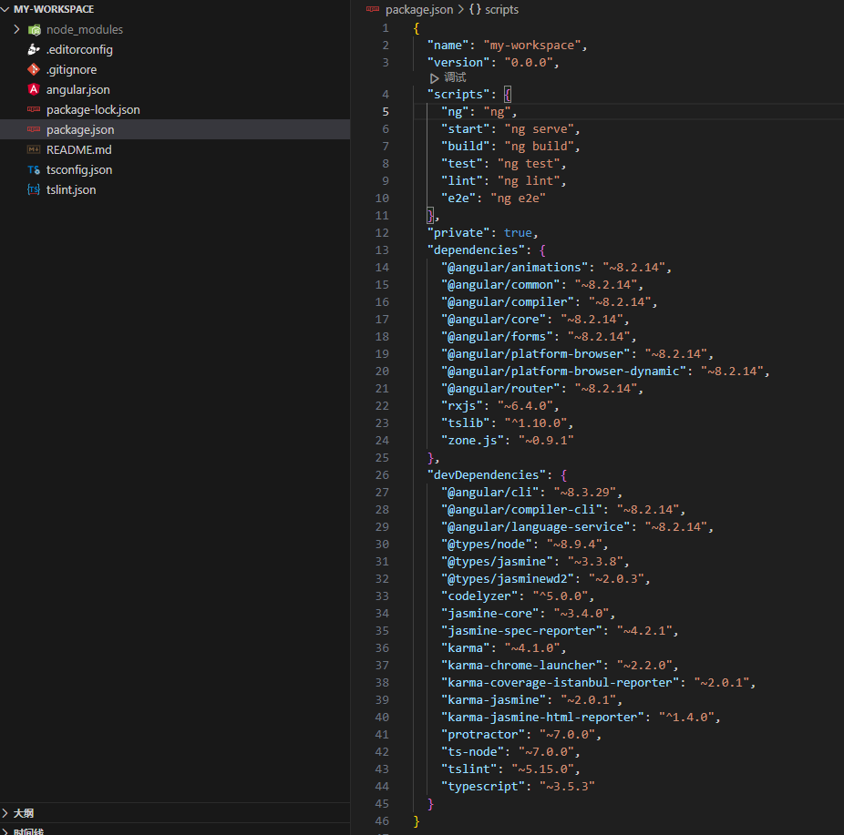
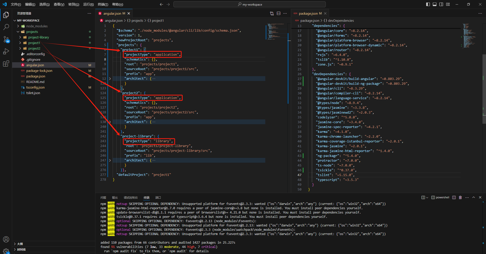

## 工作区以及应用的生成顺序

多重项目仅仅是解决多项目能够依赖同一个库同一个node_modules的问题，并不能解决实现微前端的功能，也就意味着项目间还是独立的，数据并不互通

如下命令，生成一个叫my-workspace的工作区。```--create-application false```不生成应用

```shell
ng new my-workspace --create-application false
```

以上命令生成结果如下




下面的命令生成多重项目的基本文件结构和相关库下载，生成应用的时候，会自动生成```projects```目录，```angular.json```会自动更新

```shell
// 生成project1项目
ng generate application project1
// 生成project2项目
ng generate application project2
// 生成project-library库
ng generate library project-library
```

由于配置的是--create-application false不生成应用，所以默认启动只能访问配置的默认项目，在```angular.json```的```defaultProjec```t属性中配置也可以单独启动，单独访问。

```shell
// 启动project1项目 端口4200
ng servr project1 --port 4200
// 启动project2项目 端口4201
ng servr project2 --port 4201
```

生成之后的文件结构，每个应用单独一个文件夹



##  参考


```
https://zhuanlan.zhihu.com/p/422412118

https://v8.angular.cn/guide/workspace-config
```

