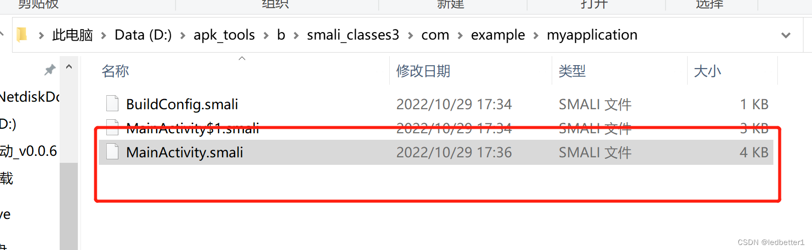
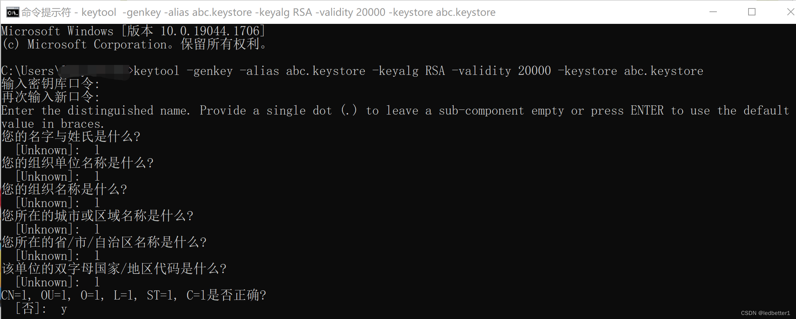

## 一、下载软件
首先下载apktool.bat和apktool.jar
官网地址：https://ibotpeaches.github.io/Apktool/install/


这个译文:
1.下载Windows包装脚本（右键单击，将链接另存为apktool.bat）
2.下载apktool-2（在此处查找最新版本）
3.将下载的jar重命名为apktool.jar
4.将两个文件（apktool.jar和apktool.bat）移动到Windows目录（通常为C://Windows）
5.如果您没有访问C://Windows的权限，可以将这两个文件放在任何位置，然后将该目录添加到环境变量系统PATH变量中。
尝试通过命令提示符运行apktool

### 第一步（apktool.bat）


一定要是右键保存，不要用迅雷！！！（下载的不是同一个东西。运行起来闪退）文件重命名为（apktool.bat）

### 第二步（apktool.jar）
这一步就按照译文，没什么坑，记得重命名（apktool.jar）


## 二、安装软件
这两个文件放到C盘去，这是我们都不想看到的，可以选择在D盘自己建一个文件夹来存放。


只不过需要改一下环境变量此电脑->属性->高级系统设置->环境变量->找到系统变量->点击PATH然后选择编辑->新建


cmd里面输入apktool验证是否成功安装


## 三、使用软件
### 解包

```
apktool d D:\app-debug.apk -o D:\apk_tools\b
-o模式是指定解包后文件所处位置
（练习apk在文章下面我会上传自己写的测试apk）
```


### 修改文件
找到要修改的文件，进行修改, 修改具体细节就不展示了，大家可以自己进去摸索



### 重打包
修改完，肯定是要用的，用apktool着手重打包

```
apktool.bat b D:\apk_tools\b -o D:\apk_tools\nopassword.apk
```


打包完成后会发现指定的目录下出现了打包好的nopassword.apk文件。但是这个apk没有签名，需要重新签名之后，才能安装。

### 签名
生成keystore文件
首先需要生成keystore文件

```
keytool -genkey -alias abc.keystore -keyalg RSA -validity 20000 -keystore abc.keystore
```


keytool命令需要java环境才可以使用，如果环境变量配置了的可以直接使用，如果没配置的可以在Java/bin下面找到，把这个路径新增到环境变量， 和上面的apktool新增到环境变量是一样的操作


然后在cmd里面输入就可以了，在当前目录下会生成一个abc.keystore证书文件




将该文件和apktool文件放在一起会比较方便

### 进行签名

```
jarsigner -verbose -keystore abc.keystore -signedjar nopassword_signed.apk nopassword.apk abc.keystore
```


执行之后会发现，在当前目录下生成一个nopassword_signed.apk，代表apk已经签名了，就可以正常使用了。


## 四、使用
将apk直接丢入夜神模拟器即可完成安装
