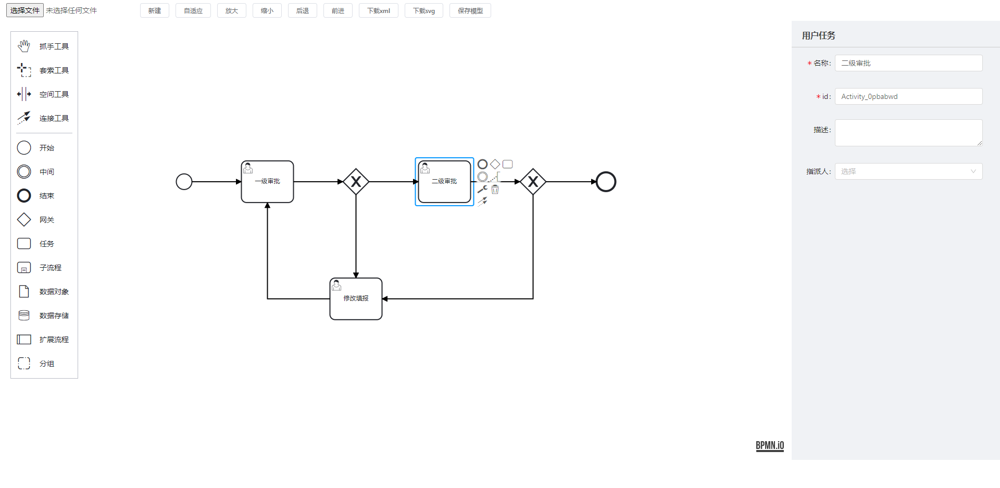

**本文档对应说明对应的bpmn-js版本是10.0.0，与网上普遍的教程存在差异(包的路径)，以及针对属性面板，不使用第三方库，也不使用官方库，因为一是难看，二是扩展属性不方便，三是存在汉化问题**



## 1、安装

```
npm i bpmn-js
```

## 2、在angular.json中引入css

```json
"styles": [
    "node_modules/bpmn-js/dist/assets/diagram-js.css",
    "node_modules/bpmn-js/dist/assets/bpmn-font/css/bpmn.css",
    "src/styles.css"
],
```

## 3、使用，仅展示核心代码

完成以下代码就完成了bpmn流程图的初始化，已经能够正常使用了

```javascript
import customTranslate from 'src/assets/customTranslate';
import { commonParse, userTaskParse } from './parse-element';

ngAfterViewInit() {
    // 生成实例
    this.modeler = new Modeler({
        container: '#demo',//容器
        width: '100%',//画板的大小,这里的百分百实际是要依托宿主容器的宽高，即宿主容器(div)要有实际的宽高
        height: '100%',
        propertiesPanel: {
            // parent: '#properties'
        },
        additionalModules: [
            { translate: ['value', customTranslate] },// 汉化
            // 以下属性根据需求功能情况进行相关控制
            // {
            //   // 禁用滚轮滚动
            //   zoomScroll: ["value", ""],
            //   // 禁止拖动线
            //   bendpoints: ["value", ""],
            //   // 禁用左侧面板
            //   paletteProvider: ["value", ""],
            //   // 禁止点击节点出现contextPad，即节点编辑面板
            //   contextPadProvider: ["value", ""],
            //   // 禁止双击节点出现label编辑框
            //   labelEditingProvider: ["value", ""]
            // }
        ],
        keyboard: {
            bindTo: window // 键盘快捷键
        }
    });
    // 获取全局modeling
    const modeling = this.modeler.get('modeling');

    this.loadDiagram(modeling);
}


loadDiagram(modeling): void {
    const url = 'assets/diagram.bpmn';
    this.https.get(url, {
      headers: { observe: 'response' },
      responseType: 'text'
    }).subscribe({
      next: res => {
        from(this.modeler.importXML(res) as Promise<{ warnings: Array<any> }>).subscribe(data => {
          // 屏幕自适应
          this.modeler.get("canvas").zoom('fit-viewport', 'auto');
          // 定义样式，根据情况设置
          // this.setColor(modeling);
          // this.adjustPalette();
        })
      }
    })

    this.modeler.on('root.added', e => {
      if (e.element.type === 'bpmn:Process') {
        this.element = e.element;
        let cache = commonParse(this.element)
        cache = userTaskParse(cache)
        this.nodeData = cache;
      }
    })

    this.modeler.on('element.click', e => {
      this.element = e.element;
      let cache = commonParse(this.element)
      cache = userTaskParse(cache)
      console.log('解析的属性', cache);
      this.nodeData = cache;
    });
}
```

## 4、自定义属性

bpmn-js初始固有属性只有id，name，documentation（描述）三个属性，要扩展节点属性，网上的方法大多是依赖```bpmn-js-properties-panel```这个库，但是配置有点复杂，节点定义文件没有注释，我也看不懂，这里投机取巧

新建的时候，直接在bpmn的xml中添加自定义属性的命名空间

```html
xmlns:activiti="http://activiti.org/bpmn" 
targetNamespace="http://www.activiti.org/processdef"
```

具体位置如下，activiti是自定义属性的前缀

```xml
<?xml version="1.0" encoding="UTF-8"?>
<definitions xmlns="http://www.omg.org/spec/BPMN/20100524/MODEL" 
             xmlns:xsi="http://www.w3.org/2001/XMLSchema-instance" 
             xmlns:bpmndi="http://www.omg.org/spec/BPMN/20100524/DI" 
             xmlns:omgdc="http://www.omg.org/spec/DD/20100524/DC" 
             xmlns:bioc="http://bpmn.io/schema/bpmn/biocolor/1.0" 
             xmlns:xsd="http://www.w3.org/2001/XMLSchema" 
             xmlns:activiti="http://activiti.org/bpmn" 
             targetNamespace="http://www.activiti.org/processdef">
    <process id="process_fqkrxujd" name="name_8tjfhiut">
        <startEvent id="startNode1" name="开始" />
    </process>
    <bpmndi:BPMNDiagram id="BPMNDiagram_flow">
        <bpmndi:BPMNPlane id="BPMNPlane_flow" bpmnElement="T-2d89e7a3-ba79-4abd-9f64-ea59621c258c">
            <bpmndi:BPMNShape id="BPMNShape_startNode1" bpmnElement="startNode1" bioc:stroke="">
                <omgdc:Bounds x="240" y="200" width="30" height="30" />
                <bpmndi:BPMNLabel>
                    <omgdc:Bounds x="242" y="237" width="23" height="14" />
                </bpmndi:BPMNLabel>
            </bpmndi:BPMNShape>
        </bpmndi:BPMNPlane>
    </bpmndi:BPMNDiagram>
</definitions>
```

定义好名称空间之后，通过updateProperties进行自定义属性的命名和赋值，如下

```javascript
/**
 * 设置节点属性
 * @param itemName 表单控件名称
 * @param value 值
 */
formItemChange(itemName: string, value: string) {
    const modeling = this.modeler.get('modeling')
    if (itemName === 'name') {
        modeling.updateLabel(this.element, value)
    } else if (itemName === 'id') {
        modeling.updateProperties(this.element, { id: value })
    } else if (itemName === 'desc') {
        if (!value) {
            modeling.updateProperties(this.element, { documentation: [] })
            return
        }
        const documentationElement = this.modeler.get('moddle').create('bpmn:Documentation', { text: value })
        modeling.updateProperties(this.element, { documentation: [documentationElement] })
    } else { // 自定义属性，属性要和命名空间一致
        let obj = {};
        obj[`activiti:${itemName}`] = value;
        modeling.updateProperties(this.element, obj)
    }
}
```

以上方法就完成了自定义属性

将设置好的流程图下载下载即可验证是否添加成功，如下，assignee是定义的自定义属性，值是zhangsan，后台activity拿到xml之后就可以进行解析了

```xml
<userTask id="Activity_0pbabwd" name="二级审批" activiti:assignee="zhangsan">
    <documentation>描述</documentation>
    <incoming>Flow_1oexhjd</incoming>
    <outgoing>Flow_0oidzit</outgoing>
</userTask>
```

## 新增

```javascript
// xmlStr xml字符串
this.modeler.importXML(xmlStr)
```

## 保存xml

```javascript
this.modeler.saveXML({ format: true })
```

## 保存svg

```javascript
this.modeler.saveSVG({ format: true })
```

## 下载

```javascript
downloadFile(filename, data, type) {
    let a = document.createElement('a')
    let url = window.URL.createObjectURL(new Blob([data], { type: type }))
    a.href = url
    a.download = filename
    a.click()
    window.URL.revokeObjectURL(url)
}
```

## 前进

```javascript
this.modeler.get('commandStack').redo()
```

## 后退

```javascript
this.modeler.get('commandStack').undo()
```

## 放大缩小

```javascript
// true放大
zoomViewport(zoomIn = true) {
    this.zoom = this.modeler.get('canvas').zoom()
    this.zoom += (zoomIn ? 0.1 : -0.1)
    this.modeler.get('canvas').zoom(this.zoom)
}
```

## 建模器的一些事件

```javascript
this.modeler.on('root.added', e => {})// 根节点添加完成
this.modeler.on('element.click', e => {})// 单击
this.modeler.on('element.dblclick', e => {})// 双击
this.modeler.on('element.changed', e => {})// 修改
this.modeler.on('shape.added', e => {})// 图形增加
this.modeler.on('connect.end', e => {})// 增加连线
this.modeler.on('connection.remove', e => {})// 删除连线
this.modeler.on('drag.cleanup', e => {})// 元素拖拽
```


## 引入的一些文件情况

- parse-element.ts

```javascript
export function commonParse(element) {
  const result = {
    ...element.businessObject,
    ...element.businessObject.$attrs
  }
  return formatJsonKeyValue(result)
}

export function formatJsonKeyValue(result) {
  // 移除activiti前缀，格式化数组
  for (const key in result) {
    if (key.indexOf('activiti:') === 0) {
      const newKey = key.replace('activiti:', '')
      result[newKey] = result[key]
      delete result[key]
    }
  }
  result = documentationParse(result)
  return result
}
/**
 * 解析描述
 * @param obj 
 * @returns 
 */
export function documentationParse(obj) {
  if ('documentation' in obj) {
    let str = ''
    obj.documentation.forEach(item => {
      str += item.text
    })
    obj.documentation = str
  }
  return obj
}

export function conditionExpressionParse(obj) {
  if ('conditionExpression' in obj) {
    obj.conditionExpression = obj.conditionExpression.body
  }
  return obj
}

export function userTaskParse(obj) {
  for (const key in obj) {
    if (key === 'candidateUsers') {
      obj.userType = 'candidateUsers'
      obj[key] = obj[key].split(',') || []
    } else if (key === 'candidateGroups') {
      obj.userType = 'candidateGroups'
      obj[key] = obj[key].split(',') || []
    } else if (key === 'assignee') {
      obj.userType = 'assignee'
    }
  }
  return obj
}

```

- customTranslate.ts

```javascript
export default {
  // Labels
  'Activate the global connect tool': '激活全局连接工具',
  'Append {type}': '添加 {type}',
  'Add Lane above': '在上面添加道',
  'Divide into two Lanes': '分割成两个道',
  'Divide into three Lanes': '分割成三个道',
  'Add Lane below': '在下面添加道',
  'Append compensation activity': '追加补偿活动',
  'Change type': '修改类型',
  'Connect using Association': '使用关联连接',
  'Connect using Sequence/MessageFlow or Association': '使用顺序/消息流或者关联连接',
  'Connect using DataInputAssociation': '使用数据输入关联连接',
  'Remove': '移除',
  'Activate the hand tool': '激活抓手工具',
  'Activate the lasso tool': '激活套索工具',
  'Activate the create/remove space tool': '激活创建/删除空间工具',
  'Create expanded SubProcess': '创建扩展子过程',
  'Create IntermediateThrowEvent/BoundaryEvent': '创建中间抛出事件/边界事件',
  'Create Pool/Participant': '创建池/参与者',
  'Parallel Multi Instance': '并行多重事件',
  'Sequential Multi Instance': '时序多重事件',
  'DataObjectReference': '数据对象参考',
  'DataStoreReference': '数据存储参考',
  'Loop': '循环',
  'Ad-hoc': '即席',
  'Create {type}': '创建 {type}',
  'Task': '任务',
  'Send Task': '发送任务',
  'Receive Task': '接收任务',
  'User Task': '用户任务',
  'Manual Task': '手工任务',
  'Business Rule Task': '业务规则任务',
  'Service Task': '服务任务',
  'Script Task': '脚本任务',
  'Call Activity': '调用活动',
  'Sub Process (collapsed)': '子流程（折叠的）',
  'Sub Process (expanded)': '子流程（展开的）',
  'Start Event': '开始事件',
  'StartEvent': '开始事件',
  'Intermediate Throw Event': '中间事件',
  'End Event': '结束事件',
  'EndEvent': '结束事件',
  'Create Gateway': '创建网关',
  'Create Intermediate/Boundary Event': '创建中间/边界事件',
  'Message Start Event': '消息开始事件',
  'Timer Start Event': '定时开始事件',
  'Conditional Start Event': '条件开始事件',
  'Signal Start Event': '信号开始事件',
  'Error Start Event': '错误开始事件',
  'Escalation Start Event': '升级开始事件',
  'Compensation Start Event': '补偿开始事件',
  'Message Start Event (non-interrupting)': '消息开始事件（非中断）',
  'Timer Start Event (non-interrupting)': '定时开始事件（非中断）',
  'Conditional Start Event (non-interrupting)': '条件开始事件（非中断）',
  'Signal Start Event (non-interrupting)': '信号开始事件（非中断）',
  'Escalation Start Event (non-interrupting)': '升级开始事件（非中断）',
  'Message Intermediate Catch Event': '消息中间捕获事件',
  'Message Intermediate Throw Event': '消息中间抛出事件',
  'Timer Intermediate Catch Event': '定时中间捕获事件',
  'Escalation Intermediate Throw Event': '升级中间抛出事件',
  'Conditional Intermediate Catch Event': '条件中间捕获事件',
  'Link Intermediate Catch Event': '链接中间捕获事件',
  'Link Intermediate Throw Event': '链接中间抛出事件',
  'Compensation Intermediate Throw Event': '补偿中间抛出事件',
  'Signal Intermediate Catch Event': '信号中间捕获事件',
  'Signal Intermediate Throw Event': '信号中间抛出事件',
  'Message End Event': '消息结束事件',
  'Escalation End Event': '定时结束事件',
  'Error End Event': '错误结束事件',
  'Cancel End Event': '取消结束事件',
  'Compensation End Event': '补偿结束事件',
  'Signal End Event': '信号结束事件',
  'Terminate End Event': '终止结束事件',
  'Message Boundary Event': '消息边界事件',
  'Message Boundary Event (non-interrupting)': '消息边界事件（非中断）',
  'Timer Boundary Event': '定时边界事件',
  'Timer Boundary Event (non-interrupting)': '定时边界事件（非中断）',
  'Escalation Boundary Event': '升级边界事件',
  'Escalation Boundary Event (non-interrupting)': '升级边界事件（非中断）',
  'Conditional Boundary Event': '条件边界事件',
  'Conditional Boundary Event (non-interrupting)': '条件边界事件（非中断）',
  'Error Boundary Event': '错误边界事件',
  'Cancel Boundary Event': '取消边界事件',
  'Signal Boundary Event': '信号边界事件',
  'Signal Boundary Event (non-interrupting)': '信号边界事件（非中断）',
  'Compensation Boundary Event': '补偿边界事件',
  'Exclusive Gateway': '互斥网关',
  'Parallel Gateway': '并行网关',
  'Inclusive Gateway': '相容网关',
  'Complex Gateway': '复杂网关',
  'Event based Gateway': '事件网关',
  'Transaction': '转运',
  'Sub Process': '子流程',
  'Event Sub Process': '事件子流程',
  'Collapsed Pool': '折叠池',
  'Expanded Pool': '展开池',
  // Errors
  'no parent for {element} in {parent}': '在{parent}里，{element}没有父类',
  'no shape type specified': '没有指定的形状类型',
  'flow elements must be children of pools/participants': '流元素必须是池/参与者的子类',
  'out of bounds release': 'out of bounds release',
  'more than {count} child lanes': '子道大于{count} ',
  'element required': '元素不能为空',
  'diagram not part of bpmn:Definitions': '流程图不符合bpmn规范',
  'no diagram to display': '没有可展示的流程图',
  'no process or collaboration to display': '没有可展示的流程/协作',
  'element {element} referenced by {referenced}#{property} not yet drawn': '由{referenced}#{property}引用的{element}元素仍未绘制',
  'already rendered {element}': '{element} 已被渲染',
  'failed to import {element}': '导入{element}失败',
  // 属性面板的参数
  'Id': '标识',
  'Name': '名称',
  'General': '常规',
  'Details': '详情',
  'Message Name': '消息名称',
  'Message': '消息',
  'Initiator': '创建者',
  'Asynchronous Continuations': '持续异步',
  'Asynchronous Before': '异步前',
  'Asynchronous After': '异步后',
  'Job Configuration': '工作配置',
  'Exclusive': '排除',
  'Job Priority': '工作优先级',
  'Retry Time Cycle': '重试时间周期',
  'Documentation': '文档',
  'Element Documentation': '元素文档',
  'History Configuration': '历史配置',
  'History Time To Live': '历史的生存时间',
  'Forms': '表单',
  'Form Key': '表单key',
  'Form Fields': '表单字段',
  'Business Key': '业务key',
  'Form Field': '表单字段',
  'ID': '编号',
  'Type': '类型',
  'Label': '名称',
  'Default Value': '默认值',
  'Validation': '校验',
  'Add Constraint': '添加约束',
  'Config': '配置',
  'Properties': '属性',
  'Add Property': '添加属性',
  'Value': '值',
  'Listeners': '监听器',
  'Execution Listener': '执行监听',
  'Event Type': '事件类型',
  'Listener Type': '监听器类型',
  'Java Class': 'Java类',
  'Expression': '表达式',
  'Must provide a value': '必须提供一个值',
  'Delegate Expression': '代理表达式',
  'Script': '脚本',
  'Script Format': '脚本格式',
  'Script Type': '脚本类型',
  'Inline Script': '内联脚本',
  'External Script': '外部脚本',
  'Resource': '资源',
  'Field Injection': '字段注入',
  'Extensions': '扩展',
  'Input/Output': '输入/输出',
  'Input Parameters': '输入参数',
  'Output Parameters': '输出参数',
  'Parameters': '参数',
  'Output Parameter': '输出参数',
  'Timer Definition Type': '定时器定义类型',
  'Timer Definition': '定时器定义',
  'Date': '日期',
  'Duration': '持续',
  'Cycle': '循环',
  'Signal': '信号',
  'Signal Name': '信号名称',
  'Escalation': '升级',
  'Error': '错误',
  'Link Name': '链接名称',
  'Condition': '条件名称',
  'Variable Name': '变量名称',
  'Variable Event': '变量事件',
  'Specify more than one variable change event as a comma separated list.': '多个变量事件以逗号隔开',
  'Wait for Completion': '等待完成',
  'Activity Ref': '活动参考',
  'Version Tag': '版本标签',
  'Executable': '可执行文件',
  'External Task Configuration': '扩展任务配置',
  'Task Priority': '任务优先级',
  'External': '外部',
  'Connector': '连接器',
  'Must configure Connector': '必须配置连接器',
  'Connector Id': '连接器编号',
  'Implementation': '实现方式',
  'Field Injections': '字段注入',
  'Fields': '字段',
  'Result Variable': '结果变量',
  'Topic': '主题',
  'Configure Connector': '配置连接器',
  'Input Parameter': '输入参数',
  'Assignee': '代理人',
  'Candidate Users': '候选用户',
  'Candidate Groups': '候选组',
  'Due Date': '到期时间',
  'Follow Up Date': '跟踪日期',
  'Priority': '优先级',
  'The follow up date as an EL expression (e.g. ${someDate} or an ISO date (e.g. 2015-06-26T09:54:00)': '跟踪日期必须符合EL表达式，如： ${someDate} ,或者一个ISO标准日期，如：2015-06-26T09:54:00',
  'The due date as an EL expression (e.g. ${someDate} or an ISO date (e.g. 2015-06-26T09:54:00)': '跟踪日期必须符合EL表达式，如： ${someDate} ,或者一个ISO标准日期，如：2015-06-26T09:54:00',
  'Variables': '变量',
  'Create Group':'分组',
  'Create StartEvent':'开始'
}

```

