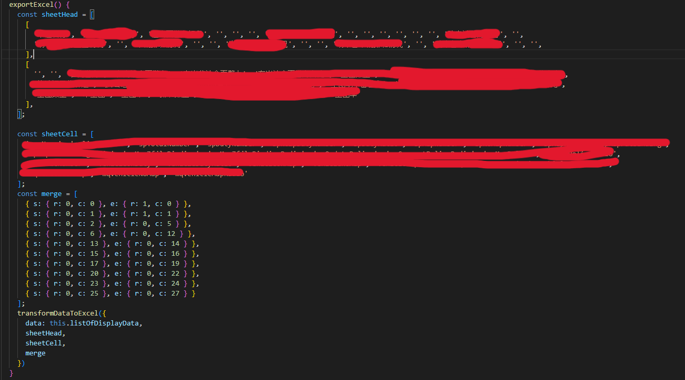
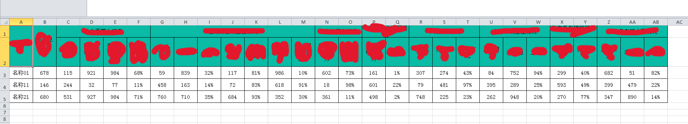

以往项目中前端**excel**导出基本都是```xlsx-js```实现，唯一不足的地方就是不能自定义样式，这里列举两个库进行导出，其中```xlsx-js-style```是基于```xlsx-js```再次封装，实现了样式的自定义，api与```xlsx-js```是一致的


excel导出主要依赖xlsx.js库

## xlsx-js

文档地址

```
https://github.com/rockboom/SheetJS-docs-zh-CN
```

整理封装

```javascript
import * as XLSX from 'xlsx';

/**
 * 导出Excel
 * @author qinzhihao
 * @param excelData ExcelData
 * 如果要展示序号，表头自行添加，并处理好合并关系，同时showOrder传true
 */
export function transformDataToExcel(excelData: ExcelData) {
  const { 
      data, sheetHead, sheetCell, merge, sheetBottomName = 'Sheet1', 
      excelName = 'Excel', showOrder = false 
  } = excelData;
  const result = [];
  if (showOrder) {
    sheetHead.unshift('序号');
  }
  result.push(sheetHead);
  data.forEach((item, index) => {
    const arr = [];
    sheetCell.forEach(item1 => {
      arr.push(item[item1]);
    });
    if (showOrder) {
      arr.unshift(index + 1);
    }
    result.push(arr);
  });
  const ws: XLSX.WorkSheet = XLSX.utils.aoa_to_sheet(result);
  // const ws: XLSX.WorkSheet = XLSX.utils.json_to_sheet(excel);
  const wb: XLSX.WorkBook = XLSX.utils.book_new();
  XLSX.utils.book_append_sheet(wb, ws, sheetBottomName);
  XLSX.writeFile(wb, `${excelName}.xlsx`);
}
export interface ExcelData {
  /**列表数字集合 */
  data: Array<any>;
  /**表头 */
  sheetHead: Array<Array<string>>,
  /**读取字段 */
  sheetCell: Array<string>,
  /**底部表名 */
  sheetBottomName?: string,
  /**表名 */
  excelName?: string,
  /**序号 */
  showOrder?: boolean,
  /**合并单元格 */
  merge?: Array<any>
}
```

```javascript
// 设置单元格合并
ws["!merges"] = [{
    s: {//s为开始
        c: 1,//开始列
        r: 0//可以看成开始行,实际是取值范围
    },
    e: {//e结束
        c: 4,//结束列
        r: 0//结束行
    }
}];
// 行高
ws['!rows'] = [{ hpt: 30 }, { hpt: 30 }];
// 列宽
ws['!cols'] = [{ wpx: 100 }, { wpx: 200 }];
```

以上是使用```xlsx.js```的基本用法，已经可以实现导出，但是无法进行样式设置，要进行样式设置只能使用```xlsx-js-style.js```

## xlsx-js-style.js

文档地址

```
https://gitbrent.github.io/xlsx-js-style/
```

封装

```javascript
import * as XLSX from 'xlsx-js-style';

/**
 * 导出Excel
 * @author qinzhihao
 * @param excelData ExcelData
 * 如果要展示序号，表头自行添加，并处理好合并关系，同时showOrder传true
 */
export function transformDataToExcel(excelData: ExcelData) {
  let {
    data, sheetHead, sheetCell, merge, sheetBottomName = 'Sheet1',
    excelName, showOrder = false, headStyle, dataRowStyle
  } = excelData;
  if (!excelName) {
    excelName = `${new Date().getFullYear()}-${new Date().getMonth() + 1}-${new Date().getDate()}`
  }
  if (!dataRowStyle) {
    dataRowStyle = getStyleObject();
    dataRowStyle.fill = null;
  }
  headStyle = headStyle ? headStyle : getStyleObject();
  let result = [];
  const head = [];
  sheetHead.forEach(r => {
    const row = [];
    r.forEach(item => {
      row.push({
        v: item,
        t: "s",
        s: headStyle
      });
    })
    head.push(row);
  })
  result = [...head];
  const dataRowHeight = [];
  data.forEach((item, index) => {
    const row = [];
    dataRowHeight.push({ hpt: 25 });
    sheetCell.forEach(item1 => {
      row.push({
        v: item[item1],
        t: "s",
        s: dataRowStyle
      });
    });
    if (showOrder) {
      row.unshift(index + 1);
    }
    result.push(row);
  });
  console.log('表格数据', result);
  const ws: XLSX.WorkSheet = XLSX.utils.aoa_to_sheet(result);

  merge && (ws["!merges"] = merge);
  ws['!rows'] = [{ hpt: 25 }, { hpt: 60 }, ...dataRowHeight];
  // ws['!cols'] = [{ wpx: 200 }, { wpx: 100 }];

  // const ws: XLSX.WorkSheet = XLSX.utils.json_to_sheet(excel);
  const wb: XLSX.WorkBook = XLSX.utils.book_new();
  XLSX.utils.book_append_sheet(wb, ws, sheetBottomName);
  XLSX.writeFile(wb, `${excelName}.xlsx`);
}
/**
 * 导出时传入的对象
 */
export interface ExcelData {
  /**列表数据集合 */
  data: Array<any>;
  /**表头，按行写入，如果包含单元格合并，被合并的项传空值 */
  sheetHead: Array<Array<string>>,
  /**读取数据集合中的字段，顺序要与表头对应 */
  sheetCell: Array<string>,
  /**底部表名 */
  sheetBottomName?: string,
  /**表名 */
  excelName?: string,
  /**序号 */
  showOrder?: boolean,
  /**合并单元格 */
  merge?: Array<any>,
  /**表头样式 */
  headStyle?,
  /**数据行样式 */
  dataRowStyle?,
}
/**
 * 表格基础样式格式与默认值
 */
export function getStyleObject() {
  return {
    font: {
      name: "宋体",
      sz: 11,
      bold: false,
      color: { rgb: "000" },
    },
    alignment: {
      horizontal: "center",
      vertical: "center",
      wrapText: true
    },
    fill: { fgColor: { rgb: "0abba5" } },
    border: {
      top: { style: 'thin' },
      right: { style: 'thin' },
      bottom: { style: 'thin' },
      left: { style: 'thin' }
    }
  }
}

```

单个单元格设置样式

```javascript
ws["A1"] = {
    // 自定义样式
    s: {
        font: {
            name: "宋体",
            sz: 40,
            bold: true,
            color: { rgb: "FFFFAA00" },
        },
        alignment: {
            horizontal: "center",
            vertical: "center",
        },
        fill: { bgcolor: { rgb: "ffff00" } },
    },
}
```

## 使用参考



## 效果



## 数据行单元格合并参考


```javascript
data.forEach((item: Array<any>, index) => {
    const row = [];
    dataRowHeight.push({ hpt: 30 });
    item.forEach((obj, cellIndex) => {

        if (obj.rowspan > 1) {
            merge.push({ s: { r: index + 1, c: cellIndex }, e: { r: index + obj.rowspan, c: cellIndex } });
        }

        row.push({ v: obj.value, t: "s", s: dataRowStyle });
    })
    if (showOrder) {
        row.unshift(index + 1);
    }
    result.push(row);
});
```

