（注意：如果手机设置代理后，测玩之后记得恢复原样，要不然手机无法正常上网。）

## 1、环境准备

1、电脑上安装[fiddler](https://so.csdn.net/so/search?q=fiddler&spm=1001.2101.3001.7020)

## 2、设置

1.[fiddler](https://so.csdn.net/so/search?q=fiddler&spm=1001.2101.3001.7020)>Tools>Fiddler Options>Connections 勾选Allow remote computers to connect。
2.记住这里的端口号：8888，后面会用到。
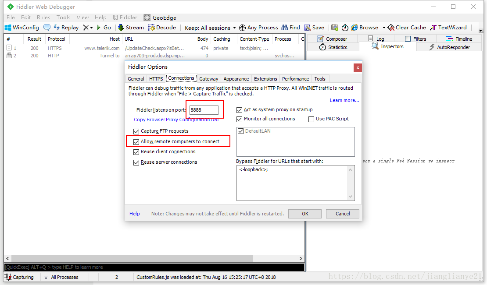

## 3、查看电脑ip

1.打开[cmd](https://so.csdn.net/so/search?q=cmd&spm=1001.2101.3001.7020)，输入：[ipconfig](https://so.csdn.net/so/search?q=ipconfig&spm=1001.2101.3001.7020),记住这个IPv4地址。
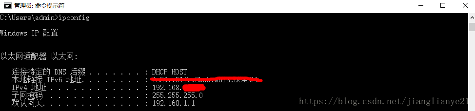

## 4、设置代理

1.手机设置->WLAN设置->选择该wifi，点右边的箭头（有的手机是长按弹出选项框）。
2.选择修改网络配置：

服务器主机名：与主机电脑IP地址保持一致

服务器端口号：8888
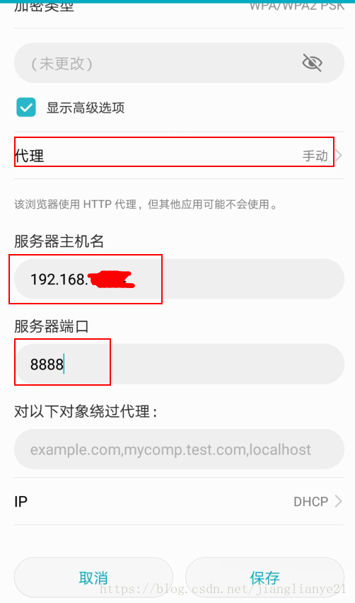

3.保存后就可以抓到来自手机的请求了。
4.手机端用浏览器访问```http://IP：端口```，用电脑的端口和fiddler设置的端口访问安装证书，访问网络，观察fiddler能否成功[抓包](https://so.csdn.net/so/search?q=抓包&spm=1001.2101.3001.7020)。这时候一般情况下手机网络能访问，抓包成功。

## 5、连上电脑后，手机可能连不上网，解决方式

（1）打开注册表，在HKEY_CURRENT_USER\SOFTWARE\Microsoft\Fiddler2下创建一个DWORD，值设置为80（十进制）
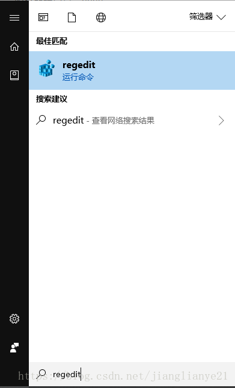
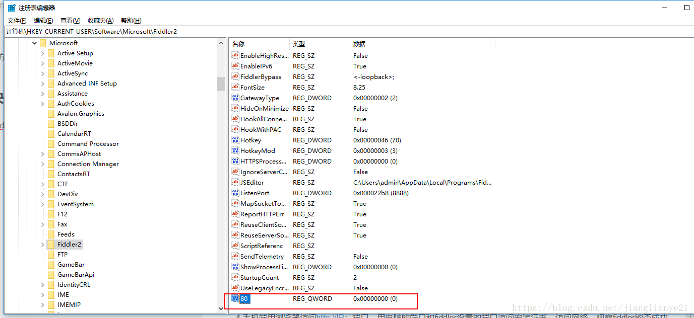
(2)编写FiddlerScript rule，点击Rules > Customize Rules,用ctr+f查找到OnBeforeRequest方法添加一行代码.

```
if (oSession.host.toLowerCase() == "webserver:8888") 
{
   oSession.host = "webserver:80";
}
```

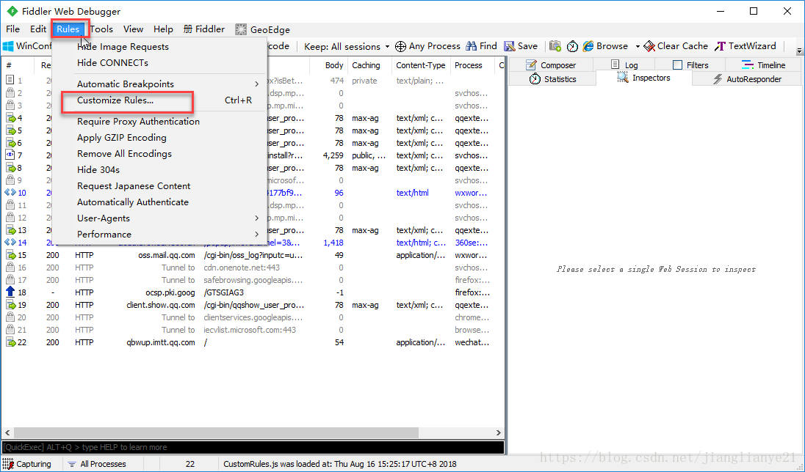

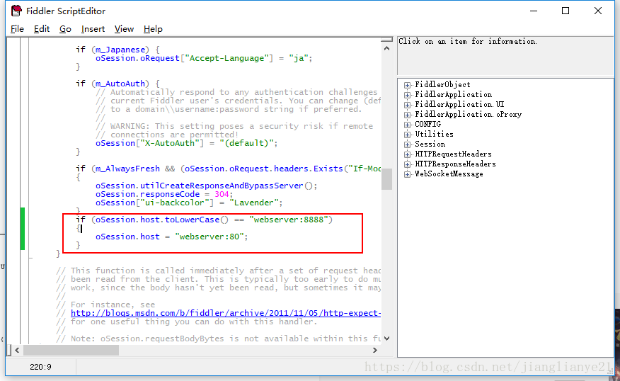
(3)此时手机应该能连上网了

## 6、抓APP上的HTTPS请求

1.如果app都是http请求，是不需要安装证书，能直接抓到的，如果是https请求，这时候手机就需要下载证书了。

2.打开手机浏览器输入：[http://10.168.xx.xx:8888](http://10.168.xx.xx:8888/) ，这个中间的host地址就是前面查到的本机地址。

3.出现如下画面，点箭头所指的位置，点击安装就可以了。最好先完成7.5的步骤，不然可能下载失败
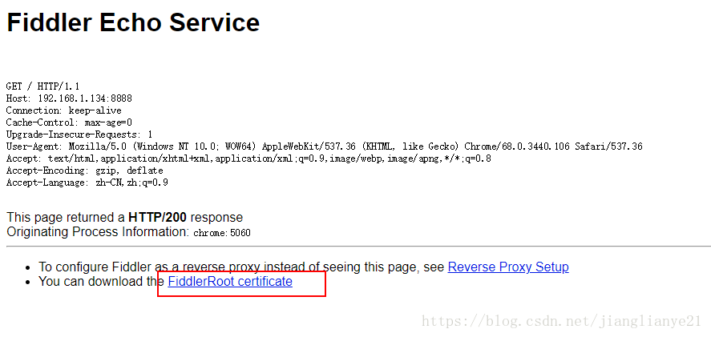

## 7、Fiddler证书安装（查看HTTPS）

1、首先确保安装的 Fiddler 是较新的版本，比较老的版本可能会出现安装不上fiddler证书生成器的问题。
2、关闭Fiddler。
3、下载并安装Fiddler证书生成器。（注：Fiddler 证书生成器只能在 Vista 以上系统运行）（前面有下载连接），也可以通过下面地址下载：
[下载地址](http://www.telerik.com/docs/default-source/fiddler/addons/fiddlercertmaker.exe?sfvrsn=2)：http://www.telerik.com/docs/default-source/fiddler/addons/fiddlercertmaker.exe?sfvrsn=2
4、打开Fiddler，点击工具栏中的Tools——>Fiddler Options…
5、切换到 HTTPS 选项卡，勾选 Capture HTTPS CONNECTs，勾选 Decrypt HTTPS trafic，会弹出安装证书的提示。一路点是或确定安装即可。
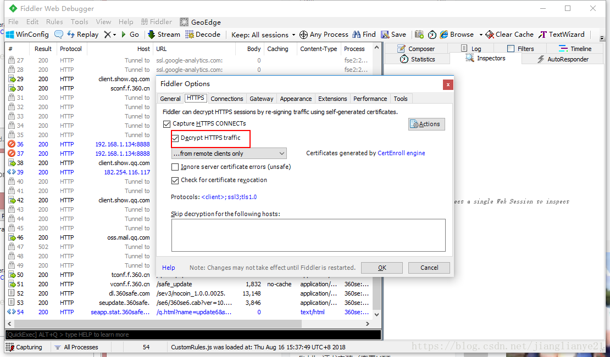
6、重启fiddler，依然停留在 HTTPS 选项卡，点击右侧Actions，能看一个下拉菜单，点击 Export Root Certificate to Desktop，此时证书会生成到桌面上，名为 FiddlerRoot.cer，点OK保存
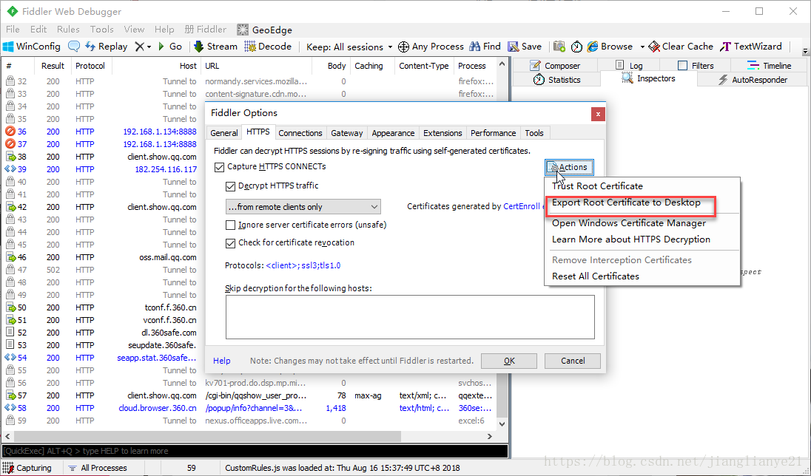
7、导入证书进行安装

注：如果手机端可以直接下载，现在之后直接点击安装就好了

这部分android和ios有一点不同。
方法一：
1）android可以连接到电脑上，从电脑上打开手机的内存卡，直接把证书复制到SD卡中。
2）点击设置——>安全——>从SD卡安装——>从内部存储空间中找到证书，点击安装即可（证书名称可随便命名）
方法二：
1）android可以连接到电脑上，从电脑上打开手机的内存卡，直接把证书复制到SD卡中。
2）找到手机上该文件存放位置，点击该文件名称，会提示安装（证书名称可随便命名）
方法三：
ios可以在手机浏览器上登录邮箱，然后将证书发送到邮箱中，在手机上查看邮件，点击附件进行证书的安装即可

8、查看HTTPS
打开fiddler，Tools——>Fiddler Options…，切换到HTTPS选项卡，把选项都勾选上，点击保存，就可以查看HTTPS接口了
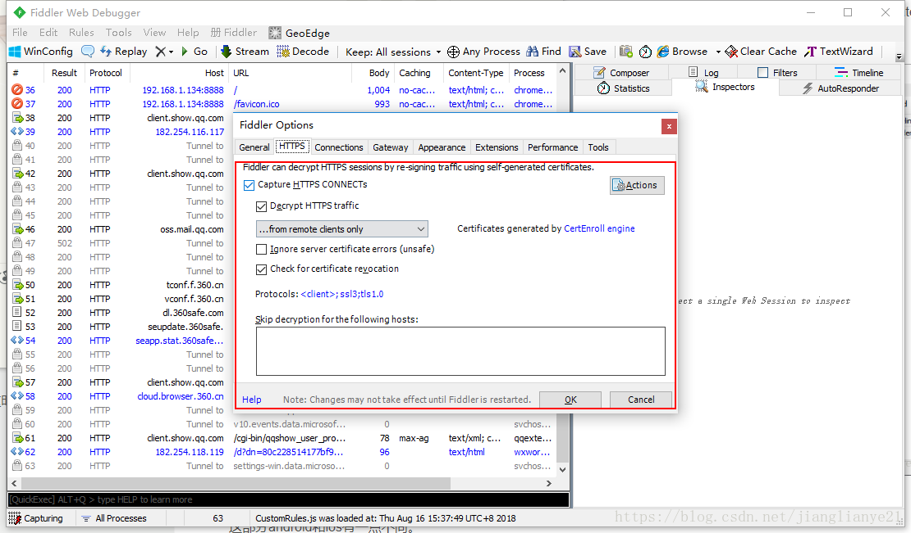

\#8、设置过滤
1.手机上设置代理后，这时候fiddler上抓到的是pc和app所有的请求，如果pc上打开网址，会很多，这时候就需要开启过滤功能了。

2.打开fiddler>Tools>Fiddler Options>HTTPS>…from remote clients only,勾选这个选项就可以了

…from all processes :抓所有的请求

…from browsers only ：只抓浏览器的请求

…from non-browsers only :只抓非浏览器的请求

…from remote clients only:只抓远程客户端请求
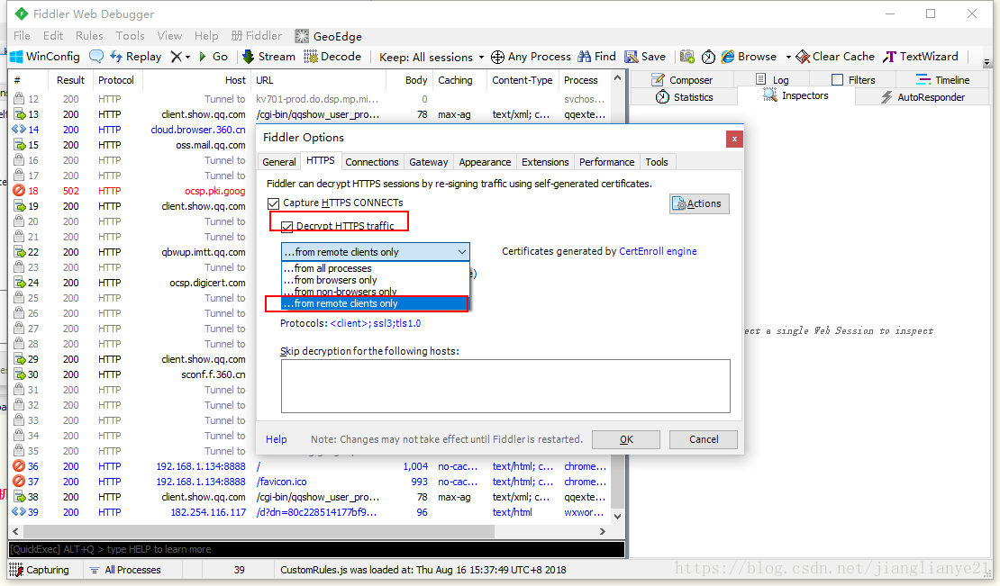
（注意：如果手机设置代理后，测玩之后记得恢复原样，要不然手机无法正常上网。）