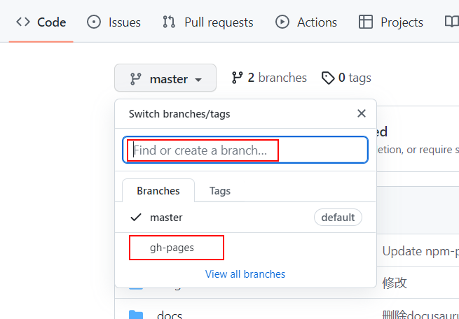
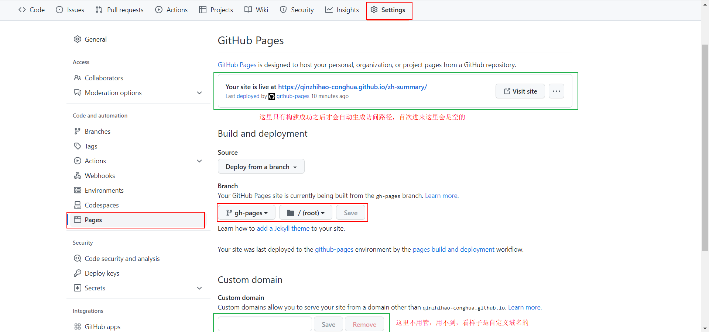
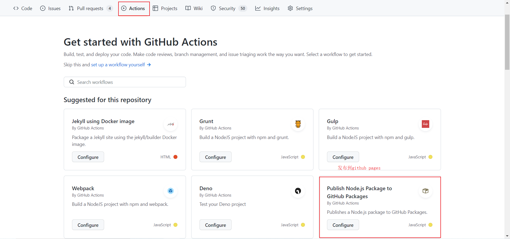
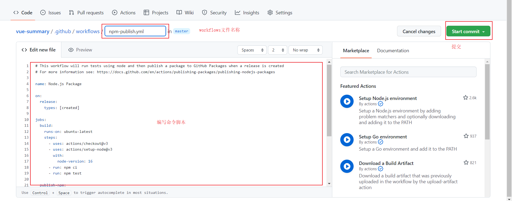

在github建好仓库之后，首先创建一个叫```gh-pages```的分支，貌似只能叫这个名，似乎有种神秘的力量。直接在搜索框输入这个分支名称，没有会出现创建的提示。他的作用就是接收主分支代码运行命令后，将打包好的代码丢到这里，一定要建好这个分支，如果在主分支上直接弄可能导致主分支代码丢失！！！！

创建好之后



setting



actions





命令参考：

注意使用的发布包JamesIves/github-pages-deploy-action@v4，这个包有可能会因为更新导致无法发布到到github pages上

```yaml
name: Deploy to GitHub Pages

on:
  push:
    branches:
      - master
    # Review gh actions docs if you want to further define triggers, paths, etc
    # https://docs.github.com/en/actions/using-workflows/workflow-syntax-for-github-actions#on

jobs:
  deploy:
    name: Deploy to GitHub Pages
    runs-on: ubuntu-latest
    steps:
    - uses: actions/setup-node@v3
      with:
          node-version: 14
    - name: Checkout
      uses: actions/checkout@master
    # This example project is built using npm and outputs the result to the 'build' folder.
    - name: Install and Build 
      run: |
          npm install
          npm run build
    - name: Deploy
      uses: JamesIves/github-pages-deploy-action@v4
      with:
          folder: build # The folder the action should deploy.
          ACCESS_TOKEN: ${{ secrets.ACCESS_TOKEN }}
          BRANCH: gh-pages
```

