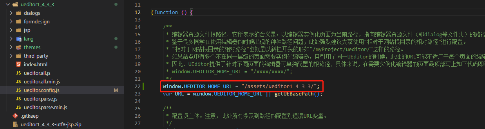
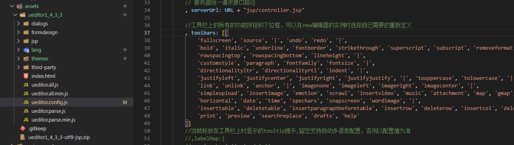
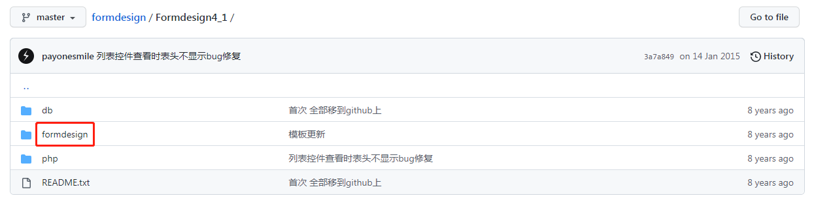
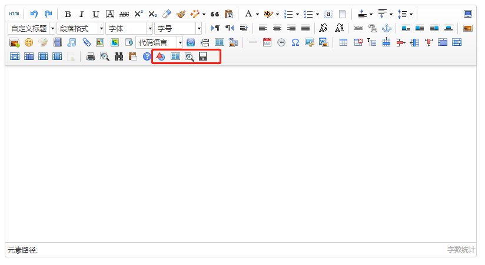
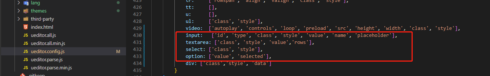
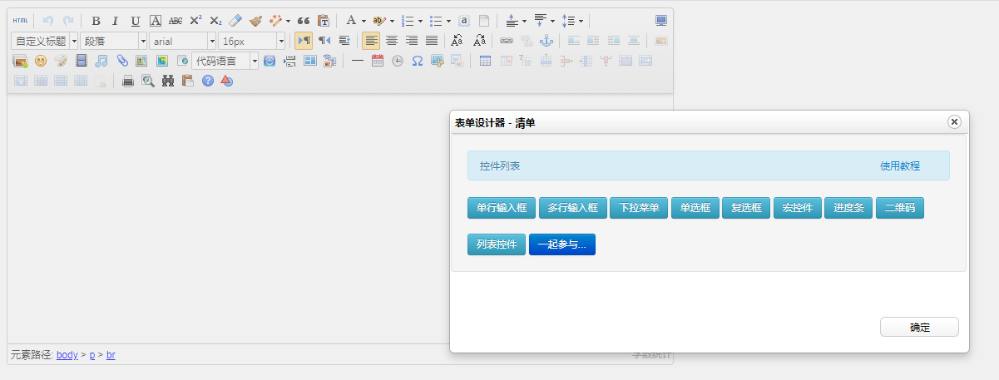
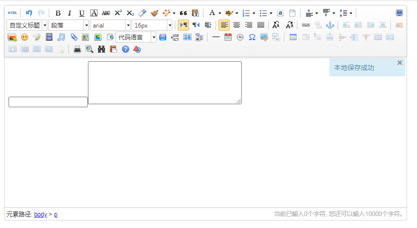

---
title:ueditor使用过程
---


ueditor版本为1.4.3.3，由于ueditor已经停止维护，所以相关的写法与引入全是js的形式

## 下载与引入

1、GitHub上下载下来之后解压到assets目录下，直接打开目录下的index.html可以直接看到demo

2、引入方式有两种，两者有区别。

- 第一种是在index.html中直接引入，这种没什么要注意的地方

```html
<script type="text/javascript" charset="utf-8" src="assets/ueditor1_4_3_3/ueditor.config.js"></script>
<script type="text/javascript" charset="utf-8" src="assets/ueditor1_4_3_3/ueditor.all.min.js"></script>
<script type="text/javascript" charset="utf-8" src="assets/ueditor1_4_3_3/lang/zh-cn/zh-cn.js"></script>
```

- 第二种是angular.json中引入，这个方式要注意的是需要在```ueditor.config.js```中配置```UEDITOR_HOME_URL```，如果不配置将会出现很多错误，包括css的MIME请求类型错误等问题

```json
"scripts": [
    "src/assets/ueditor1_4_3_3/ueditor.config.js",
    "src/assets/ueditor1_4_3_3/ueditor.all.js",
    "src/assets/ueditor1_4_3_3/lang/zh-cn/zh-cn.js"
]
```



## 使用

- 只需要一个div，定义好id

```html
<div id="editor" style="height:500px;"></div>
```

- 在ngAfterViewInit中初始化，第二个参数是编辑器的配置项，是具体情况定义，至此完成所有步骤

```javascript
ngAfterViewInit() {
    const ue = UE.getEditor('editor', {
        // toolleipi: true,
        lang: 'zh-cn',
        initialFrameHeight: 300,
        readonly: false
    });
}
```

- 在配置文件的```toolbars```中注释相关按钮就可以自定义自己所需的功能了，其他的功能设置也是在这个配置文件中配置，**包括上传的功能，需要配置后端服务路径**



## 自定义表单

- 下载第三方插件，只需要formdesign文件就好，将formdesign整个复制到ueditor下，参考上面一个截图中的位置

```
https://github.com/payonesmile/formdesign
```



- ```index.html```或者```angular.json```中引入```formdesign```文件下的```leipi.formdesign.v4.js```

```json
"scripts": [
    "src/assets/ueditor1_4_3_3/ueditor.config.js",
    "src/assets/ueditor1_4_3_3/ueditor.all.js",
    "src/assets/ueditor1_4_3_3/lang/zh-cn/zh-cn.js",
    "src/assets/ueditor1_4_3_3/formdesign/leipi.formdesign.v4.js"
]
```

- 在创建编辑器实例的时候添加```toolleipi```属性

```javascript
 ngAfterViewInit() {
     const ue = UE.getEditor('editor', {
         // 添加该属性
         toolleipi: true,
         lang: 'zh-cn',
         initialFrameHeight: 300,
         readonly: false
     });
 }
```

这时候编辑上会多出四个关于自定义编辑器的按钮，第一个按钮中选择各类表单组件，后面三个无法正常使用，但是由于雷劈网已经关闭，具体配置以及原因不清楚，第一个按钮能用就好，其他三个按钮注释掉就好



- 这时候表单并不能正常插入到编辑器中，需要在```ueditor.config.js```中配置白名单，找到```whitList```部分添加表单相关



## 展示





## 表单值的问题

上面是可以在编辑器中添加表单了，但是输入值的时候会发现实际上是无法保存的，是因为没有手动为表单设置值，所以在那进行保存的时候需要手动setAttribute之后再去拿html串进行保存

## 自定义其他按钮

参考如下，其他功能自行参考demo

```javascript
UE.registerUI('button_save',function(editor,uiName){
    if(!this.options.toolleipi)
    {
        return false;
    }
    //注册按钮执行时的command命令，使用命令默认就会带有回退操作
    editor.registerCommand(uiName,{
        execCommand:function(){
            try {
                // 逻辑代码
            } catch ( e ) {
                alert('保存异常');
            }
            
        }
    });
    //创建一个button
    var btn = new UE.ui.Button({
        //按钮的名字
        name:uiName,
        //提示
        title:"保存表单",
        //需要添加的额外样式，指定icon图标，这里默认使用一个重复的icon
        cssRules :'background-position: -481px -20px;',
        //点击时执行的命令
        onclick:function () {
            //这里可以不用执行命令,做你自己的操作也可
           editor.execCommand(uiName);
        }
    });

    //因为你是添加button,所以需要返回这个button
    return btn;
});
```

