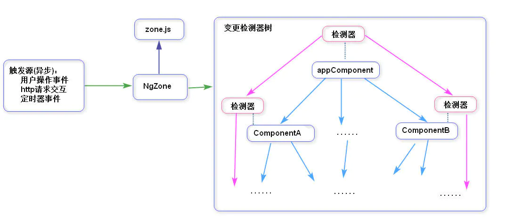
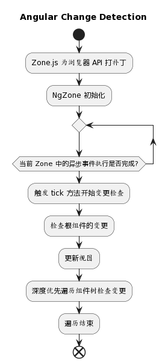
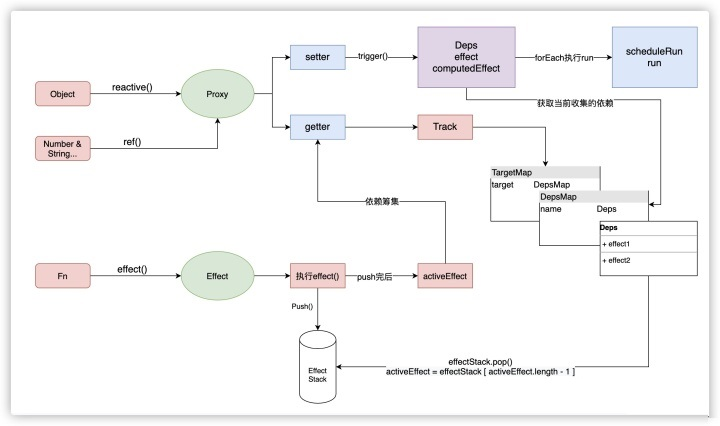
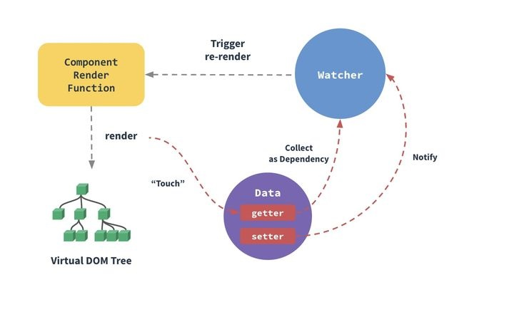

**结合相关文档对比下来，差异点在于对数据的变更检测，当一个响应式数据变化的时候，angular会对所有组件进行检测进而更新视图，而vue则直接知道哪个数据变化，从而执行针对这个数据的回调，同时结合虚拟dom技术，进而更快的渲染视图，达到更快的速度。**

## angular部分

关于angular的变更检测机制，简而言之就是：

angular通过zone.js库对浏览器的许多异步事件进行了代理，每当有异步事件的时候都会捕捉到，同时在angular中所有组件会形成一个自顶向下树状结构，每个组件都有自己的变化检测器，同理这些变化检测器也形成一个变化检测器树，数据总是从上到下流动，当捕捉到异步事件的时候会自顶向下进行检测对比，比较新旧两个值是否相同，在检查变更之后立即更新视图。



从这里可以看出，当组件树庞大以及异步事件频繁的时候，这种自顶向下的检测会十分影响性能。流程为：

1. Zone.js 为浏览器 API 打补丁
2. NgZone 初始化，监听当前 Zone 中的异步事件执行是否完成
3. 异步事件执行结束后出发 tick 方法开始变更检查
4. 变更检查由根组件开始按照深度优先遍历变更检查器树
5. 在每个数据绑定的检查结束之后，立即更新视图
6. 在继续检查子组件直到所有组件检查完成




## vue部分

关于vue的变更检测机制就比较精准和便捷，通过对数据的劫持直接捕捉变动，进而渲染视图，vue2和vue3对数据的劫持使用的方式不一样，但是思路一致，vue2使用的是```Object.defindeProperty```进行劫持，vue3使用的是ES6的```Proxy```进行劫持代理，下图是vue3的代理流程，使用```ref```和```reactive```定义的数据被`Proxy`代理，在`getter`, `setter`方法中完成比如`track(依赖收集)`, `trigger(触发更新)`,`effect(副作用)`等操作，对数据操作会触发```setter```和```getter```然后执行相应的`effect`完成视图的渲染，渲染值依赖虚拟dom技术完成更快的渲染。```effect```的作用主要是跟踪记录属性变化执行相关回调。




Vue2 的响应式原理是核心是通过 ES5 的保护对象的 `Object.defindeProperty`中的访问器属性中的 `get`和 `set`方法，data 中声明的属性都被添加了访问器属性，当读取 data 中的数据时自动调用 get 方法，当修改 data 中的数据时，自动调用 set 方法，检测到数据的变化，会通知观察者 Wacher，观察者 Wacher自动触发重新render 当前组件（子组件不会重新渲染）,生成新的虚拟 DOM 树，Vue 框架会遍历并对比新虚拟 DOM 树和旧虚拟 DOM 树中每个节点的差别，并记录下来，最后，加载操作，将所有记录的不同点，局部修改到真实 DOM 树上。

vue2的监听与渲染流程



详细的结合代码分析在相关文档里都有介绍，要了解请自行阅读。

## 参考文档

> angular部分
>
> https://skyfly.xyz/2017/07/04/Front_End/Angular/AngularChangeDetection/
>
> https://zhuanlan.zhihu.com/p/110118375
>
> https://zhuanlan.zhihu.com/p/93242237
>
> https://www.jianshu.com/p/d8ebb6daf993
>
> https://segmentfault.com/a/1190000041184771
>
> https://zhuanlan.zhihu.com/p/96640047

> vue部分
>
> https://zhuanlan.zhihu.com/p/376891439
>
> https://zhuanlan.zhihu.com/p/138114429
>
> https://zhuanlan.zhihu.com/p/88648401
>
> https://zhuanlan.zhihu.com/p/111591503
>
> https://blog.csdn.net/kang_k/article/details/105860413