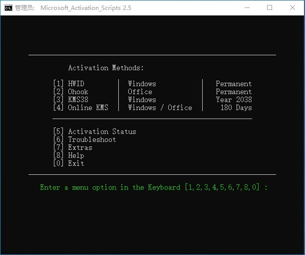

---
title:window相关
---

# 终止进程

```
// 查端口所在进程号
netstat -ano|findstr 10521
// 根据进程号终止进程
taskkill /pid 10521进程号 /f
```

# 获取bios序列号

```
wmic bios get serialnumber
```

# 获取cpu序列号

```
wmic cpu get processorid
```


# 命令激活系统或者office

```shell
irm https://massgrave.dev/get | iex

另一个说法是下面这个命令也可以
irm win.zyqq.top | iex
```

office365激活或者系统，hwid对应系统，ohook 对应office

