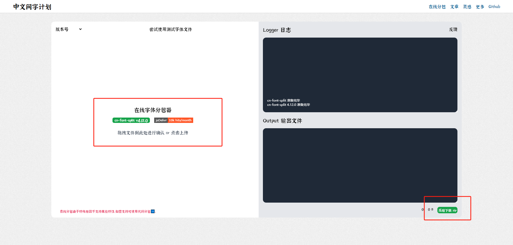
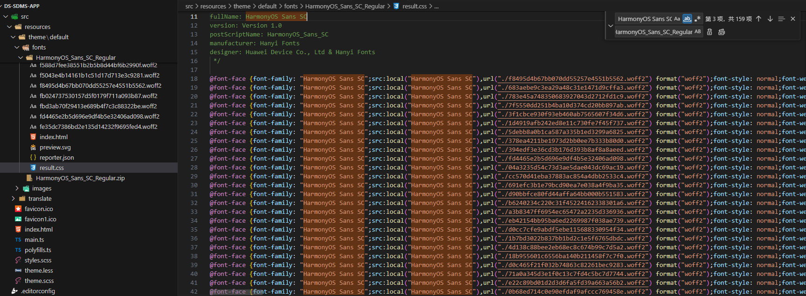
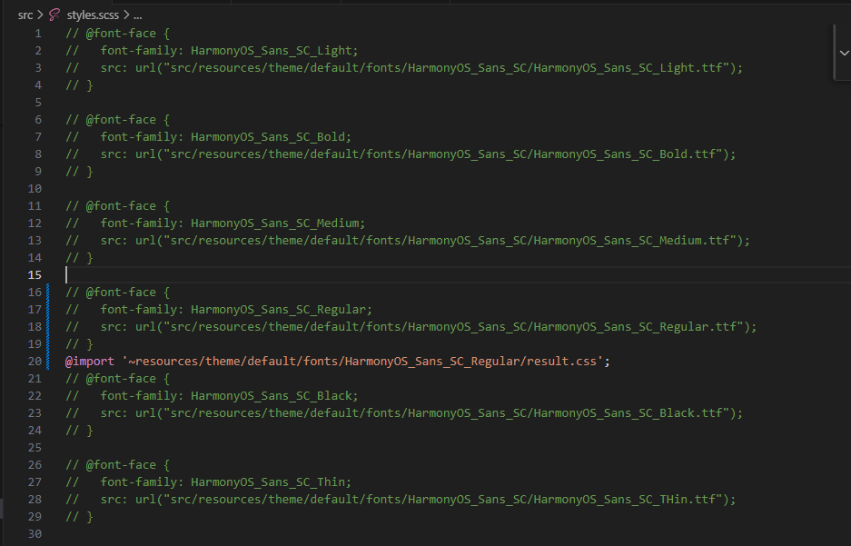
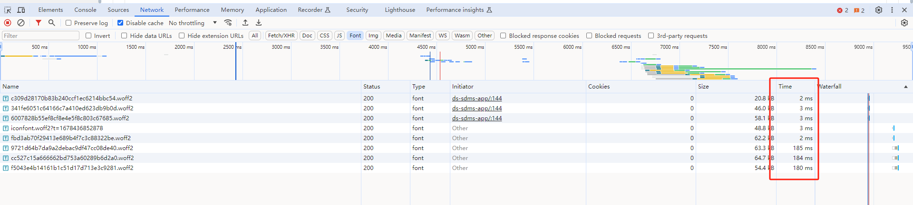

1、在下面的网站中将需要分割的字体上传并执行分割，将分割结果下载

```
https://chinese-font.netlify.app/online-split/
```




2、下载的文件中找到```result.css```，检查```font-family```是否正确，如果与系统定义个字体不一致则修改成一致，要么修改系统定义的使用的字体，要么修改```result.css```里面定义字体，如下是将```HarmonyOS Sans SC```替换成```HarmonyOS_Sans_SC_Regular```



3、在```style.scss```或者其他地方中引入```result.css```

其他项目可参考如下，通过检查发现，现在产品使用的鸿蒙字体只有三个```HarmonyOS_Sans_SC_Regular```、```HarmonyOS_Sans_SC_Medium```、```HarmonyOS_Sans_SC_Bold```，其中```HarmonyOS_Sans_SC_Regular```是系统主字体，另外两个字体使用的地方很少，因此为了几个字体的样式引入几十兆的文件是不划算的，下面的截图中都将大部分字体引入给注释了，只引入了分包之后的鸿蒙字体

```
@import '~resources/theme/default/fonts/HarmonyOS_Sans_SC_Regular/result.css';
```



4、结果查看

